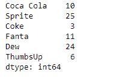
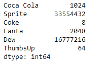
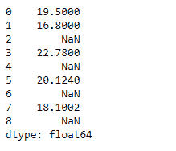
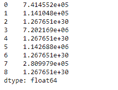

# 蟒蛇|熊猫系列. rpow()

> 原文:[https://www.geeksforgeeks.org/python-pandas-series-rpow/](https://www.geeksforgeeks.org/python-pandas-series-rpow/)

熊猫系列是带有轴标签的一维数组。标签不必是唯一的，但必须是可散列的类型。该对象支持基于整数和基于标签的索引，并提供了一系列方法来执行涉及索引的操作。

熊猫 `**Series.rpow()**`函数返回级数和其他元素的指数幂(二元运算符 rsub)。它相当于`other ** series`，但支持用 fill_value 替换其中一个输入中缺失的数据。

> **语法:** Series.rpow(其他，级别=无，fill _ value =无，轴=0)
> 
> **参数:**
> **其他:**系列或标量值
> **fill_value :** 填充现有缺失(NaN)值
> **级别:**跨级别广播，在传递的多索引级别上匹配索引值
> 
> **返回:**结果:系列

**示例#1:** 使用`Series.rpow()`函数将标量值提升到给定 Series 对象中每个元素的幂。

```
# importing pandas as pd
import pandas as pd

# Creating the Series
sr = pd.Series([10, 25, 3, 11, 24, 6])

# Create the Index
index_ = ['Coca Cola', 'Sprite', 'Coke', 'Fanta', 'Dew', 'ThumbsUp']

# set the index
sr.index = index_

# Print the series
print(sr)
```

**输出:**


现在我们将使用`Series.rpow()`函数将标量提升到给定级数对象的每个元素的幂。

```
# raise 2 to the power of each element in
# the sr object
selected_items = sr.rpow(other = 2)

# Print the returned Series object
print(selected_items)
```

**输出:**


从输出中我们可以看到，`Series.rpow()`函数已经成功返回了一个序列对象，这是求幂运算的结果。

**示例 2 :** 使用`Series.rpow()`函数将标量值提升到给定 Series 对象中每个元素的幂。

```
# importing pandas as pd
import pandas as pd

# Creating the Series
sr = pd.Series([19.5, 16.8, None, 22.78, None, 20.124, None, 18.1002, None])

# Print the series
print(sr)
```

**输出:**



现在我们将使用`Series.rpow()`函数将标量提升到给定级数对象的每个元素的幂。我们将用 100 代替所有缺少的值。

```
# raise 2 to the power of each element in
# the sr object
selected_items = sr.rpow(other = 2, fill_value = 100)

# Print the returned Series object
print(selected_items)
```

**输出:**

正如我们在输出中看到的，`Series.rpow()`函数已经成功地返回了一个序列对象，这是求幂运算的结果。