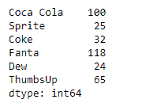
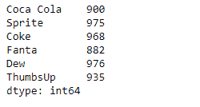
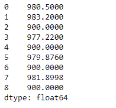

# 蟒蛇|熊猫系列. rsub()

> 原文:[https://www.geeksforgeeks.org/python-pandas-series-rsub/](https://www.geeksforgeeks.org/python-pandas-series-rsub/)

熊猫系列是带有轴标签的一维数组。标签不必是唯一的，但必须是可散列的类型。该对象支持基于整数和基于标签的索引，并提供了一系列方法来执行涉及索引的操作。

熊猫 `**Series.rsub()**`函数返回序列和其他元素的减法(二元运算符 rsub)。它相当于`other - series`，但支持用 fill_value 替换其中一个输入中缺失的数据。

> **语法:** Series.rsub(其他，级别=无，fill _ value =无，轴=0)
> 
> **参数:**
> **其他:**系列或标量值
> **fill_value :** 填充现有缺失(NaN)值
> **级别:**跨级别广播，在传递的多索引级别上匹配索引值
> 
> **返回:**结果:系列

**示例#1:** 使用`Series.rsub()`函数以标量元素方式对给定的 Series 对象执行反向减法。

```
# importing pandas as pd
import pandas as pd

# Creating the Series
sr = pd.Series([100, 25, 32, 118, 24, 65])

# Create the Index
index_ = ['Coca Cola', 'Sprite', 'Coke', 'Fanta', 'Dew', 'ThumbsUp']

# set the index
sr.index = index_

# Print the series
print(sr)
```

**输出:**



现在我们将使用`Series.rsub()`函数对给定的带有标量的 Series 对象执行元素方向的反向减法。

```
# perform reverse subtraction with 1000
selected_items = sr.rsub(other = 1000)

# Print the returned Series object
print(selected_items)
```

**输出:**



正如我们在输出中看到的，`Series.rsub()`函数已经成功地返回了给定 Series 对象与标量的反向减法。

**示例#2 :** 使用`Series.rsub()`函数以标量元素方式对给定的 Series 对象执行反向减法。给定的 Series 对象还包含一些缺失的值。

```
# importing pandas as pd
import pandas as pd

# Creating the Series
sr = pd.Series([19.5, 16.8, None, 22.78, None, 20.124, None, 18.1002, None])

# Print the series
print(sr)
```

**输出:**


现在我们将使用`Series.rsub()`函数对给定的带有标量的 Series 对象执行元素方向的反向减法。我们还将在给定序列对象中的所有缺失值处替换 100。

```
# perform reverse subtraction with 1000
# fill 100 at the place of all missing values
selected_items = sr.rsub(other = 1000, fill_value = 100)

# Print the returned Series object
print(selected_items)
```

**输出:**



正如我们在输出中看到的，`Series.rsub()`函数已经成功地返回了给定 Series 对象与标量的反向减法。