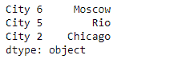
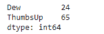

# Python |熊猫系列. sample()

> 原文:[https://www.geeksforgeeks.org/python-pandas-series-sample/](https://www.geeksforgeeks.org/python-pandas-series-sample/)

熊猫系列是带有轴标签的一维数组。标签不必是唯一的，但必须是可散列的类型。该对象支持基于整数和基于标签的索引，并提供了一系列方法来执行涉及索引的操作。

熊猫 `**Series.sample()**`函数从一个物体轴返回一个随机的物品样本。我们还可以使用 random_state 进行再现。

> **语法:**系列。样本(n =无，frac =无，替换=假，权重=无，random _ state =无，轴=无)
> 
> **参数:**
> **n :** 从轴返回的物品数量。
> **frac :** 要返回的轴项目的分数。
> **更换:**样品有无更换。
> **权重:**默认“无”导致相等的概率权重。
> **random_state :** 随机数生成器(如果为 int)或 numpy RandomState 对象的种子。
> **轴:**轴来样。
> 
> **返回:**序列或数据帧

**示例#1:** 使用`Series.sample()`函数从给定的序列对象中随机抽取值样本。

```py
# importing pandas as pd
import pandas as pd

# Creating the Series
sr = pd.Series(['New York', 'Chicago', 'Toronto', 'Lisbon', 'Rio', 'Moscow'])

# Create the Datetime Index
index_ = ['City 1', 'City 2', 'City 3', 'City 4', 'City 5', 'City 6']

# set the index
sr.index = index_

# Print the series
print(sr)
```

**输出:**

现在我们将使用`Series.sample()`函数从给定的 Series 对象中随机抽取值样本。

```py
# Draw random sample of 3 values
selected_cities = sr.sample(n = 3)

# Print the returned Series object
print(selected_cities)
```

**输出:**

正如我们在输出中看到的，`Series.sample()`函数已经成功地从给定的 Series 对象中返回了 3 个值的随机样本。

**示例 2:** 使用`Series.sample()`函数从给定的 Series 对象中随机抽取值样本。

```py
# importing pandas as pd
import pandas as pd

# Creating the Series
sr = pd.Series([100, 25, 32, 118, 24, 65])

# Create the Index
index_ = ['Coca Cola', 'Sprite', 'Coke', 'Fanta', 'Dew', 'ThumbsUp']

# set the index
sr.index = index_

# Print the series
print(sr)
```

**输出:**


现在我们将使用`Series.sample()`功能选择一个大小相当于给定 Series 对象大小 25%的随机样本。

```py
# Draw random sample of size of 25 % of the original object
selected_items = sr.sample(frac = 0.25)

# Print the returned Series object
print(selected_items)
```

**输出:**



正如我们在输出中看到的那样，`Series.sample()`函数已经成功地从给定的 series 对象中返回了 2 个值的随机样本，这是原始 Series 对象大小的 25%。