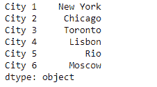
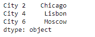
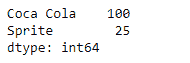

# 蟒蛇|熊猫系列. select()

> 原文:[https://www.geeksforgeeks.org/python-pandas-series-select/](https://www.geeksforgeeks.org/python-pandas-series-select/)

熊猫系列是带有轴标签的一维数组。标签不必是唯一的，但必须是可散列的类型。该对象支持基于整数和基于标签的索引，并提供了一系列方法来执行涉及索引的操作。

熊猫 `**Series.select()**`功能返回与轴标签匹配标准对应的数据。我们将函数的名称作为参数传递给这个应用于所有索引标签的函数。选择满足标准的索引标签。

> **语法:**系列。选择(暴击，轴=0)
> 
> **参数:**
> **暴击:**对每个指标(标签)调用。应返回真或假
> **轴:**整数值
> 
> **返回:**选择:与来电者类型相同

**示例#1:** 使用`Series.select()`功能从给定的系列对象中选择其索引标签以偶数结尾的所有城市的名称。

```py
# importing pandas as pd
import pandas as pd

# Creating the Series
sr = pd.Series(['New York', 'Chicago', 'Toronto', 'Lisbon', 'Rio', 'Moscow'])

# Create the Datetime Index
index_ = ['City 1', 'City 2', 'City 3', 'City 4', 'City 5', 'City 6']

# set the index
sr.index = index_

# Print the series
print(sr)
```

**输出:**



现在我们将使用`Series.select()`函数选择所有那些城市的名称，这些城市的索引标签以偶数整数值结束。

```py
# Define a function to  Select those cities whose index
# label's last character is an even integer
def city_even(city):
    # if last character is even
    if int(city[-1]) % 2 == 0:
        return True
    else:
        return False

# Call the function and select the values
selected_cities = sr.select(city_even, axis = 0)

# Print the returned Series object
print(selected_cities)
```

**输出:**



正如我们在输出中看到的那样，`Series.select()`函数已经成功返回了所有满足给定标准的城市。

**示例 2:** 使用`Series.select()`功能从给定的系列对象中选择“可口可乐”和“雪碧”的销售额。

```py
# importing pandas as pd
import pandas as pd

# Creating the Series
sr = pd.Series([100, 25, 32, 118, 24, 65])

# Create the Index
index_ = ['Coca Cola', 'Sprite', 'Coke', 'Fanta', 'Dew', 'ThumbsUp']

# set the index
sr.index = index_

# Print the series
print(sr)
```

**输出:**


现在我们将使用`Series.select()`功能从给定的 Series 对象中选择所列饮料的销量。

```py
# Function to select the sales of 
# Coca Cola and Sprite
def show_sales(x):
    if x == 'Sprite' or x == 'Coca Cola':
        return True
    else:
        return False

# Call the function and select the values
selected_cities = sr.select(show_sales, axis = 0)

# Print the returned Series object
print(selected_cities)
```

**输出:**



正如我们在输出中看到的那样，`Series.select()`函数已经成功地从给定的 Series 对象中返回了所需饮料的销售数据。