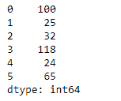
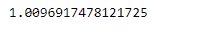

# 蟒蛇|熊猫系列. sem()

> 原文:[https://www.geeksforgeeks.org/python-pandas-series-sem/](https://www.geeksforgeeks.org/python-pandas-series-sem/)

熊猫系列是带有轴标签的一维数组。标签不必是唯一的，但必须是可散列的类型。该对象支持基于整数和基于标签的索引，并提供了一系列方法来执行涉及索引的操作。

熊猫 `**Series.sem()**`函数返回要求轴上平均值的无偏标准误差。默认情况下，结果由 N-1 归一化。这可以使用 ddof 参数进行更改。

> **语法:**series . SEM(axis =无，skipna =无，level =无，ddof=1，numeric _ only =无，**kwargs)
> 
> **参数:**
> **轴:**{ index(0)}
> **skipna:**排除 NA/null 值。
> **级别:**如果轴是多索引(分层)，则沿着特定级别计数，折叠成标量。
> **ddof:**δ自由度。
> **numeric_only :** 只包括 float、int、boolean 列。
> 
> **返回:**标量或级数(如果指定了级别)

**示例#1 :** 使用`Series.sem()`函数找到给定 Series 对象中基础数据平均值的标准误差。

```py
# importing pandas as pd
import pandas as pd

# Creating the Series
sr = pd.Series([100, 25, 32, 118, 24, 65])

# Print the series
print(sr)
```

**输出:**


现在我们用`Series.sem()`函数求底层数据均值的标准误差。

```py
# find standard error of the mean
sr.sem()
```

**输出:**


正如我们在输出中看到的，`Series.sem()`函数已经成功地计算了标准误差给定 Series 对象中底层数据的平均值。

**示例#2 :** 使用`Series.sem()`函数查找给定 Series 对象中底层数据平均值的标准误差。给定的 Series 对象还包含一些缺失的值。

```py
# importing pandas as pd
import pandas as pd

# Creating the Series
sr = pd.Series([19.5, 16.8, None, 22.78, None, 20.124, None, 18.1002, None])

# Print the series
print(sr)
```

**输出:**


现在我们用`Series.sem()`函数求底层数据均值的标准误差。

```py
# find standard error of the mean
# Skip all the missing values
sr.sem(skipna = True)
```

**输出:**



正如我们在输出中看到的，`Series.sem()`函数已经成功地计算了标准误差，即给定 Series 对象中底层数据的平均值。