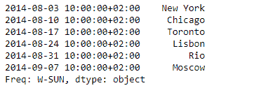
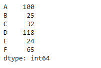

# Python |熊猫系列. set_axis()

> 原文:[https://www . geesforgeks . org/python-pandas-series-set _ axis/](https://www.geeksforgeeks.org/python-pandas-series-set_axis/)

熊猫系列是带有轴标签的一维数组。标签不必是唯一的，但必须是可散列的类型。该对象支持基于整数和基于标签的索引，并提供了一系列方法来执行涉及索引的操作。

熊猫 **Series.set_axis()** 功能用于为给定的轴分配所需的索引。列或行标签的索引可以通过分配类似列表的或索引来更改。

> **语法:** Series.set_axis(标签，axis=0，inplace=None)
> **参数:**
> **标签:**新索引的值。
> **轴:**轴更新。值 0 标识行，1 标识列。
> **原位:**是否返回新的% klass 实例。
> **返回:**重命名为:系列

**示例#1:** 使用 Series.set_axis()函数重置给定 Series 对象的轴。

## 蟒蛇 3

```
# importing pandas as pd
import pandas as pd

# Creating the Series
sr = pd.Series(['New York', 'Chicago', 'Toronto', 'Lisbon', 'Rio', 'Moscow'])

# Create the Index
index_ = ['City 1', 'City 2', 'City 3', 'City 4', 'City 5', 'City 6']

# set the index
sr.index = index_

# Print the series
print(sr)
```

**输出:**


现在我们将使用 Series.set_axis()函数来重置给定系列对象的索引

## 蟒蛇 3

```
# Create the Index
didx = pd.DatetimeIndex(start ='2014-08-01 10:00', freq ='W',
                     periods = 6, tz = 'Europe/Berlin')

# reset the index
sr.set_axis(didx, inplace = True)

# Print the series
print(sr)
```

**输出:**



正如我们在输出中看到的，Series.set_axis()函数已经成功地重置了给定 Series 对象的索引。

**示例#2:** 使用 Series.set_axis()函数重置给定 Series 对象的轴。

## 蟒蛇 3

```
# importing pandas as pd
import pandas as pd

# Creating the Series
sr = pd.Series([100, 25, 32, 118, 24, 65])

# Print the series
print(sr)
```

**输出:**


现在我们将使用 Series.set_axis()函数来重置给定系列对象的索引

## 蟒蛇 3

```
# Assign the new index
sr.set_axis(['A', 'B', 'C', 'D', 'E', 'F'], inplace = True)

# print the series
print(sr)
```

**输出:**



正如我们在输出中看到的，Series.set_axis()函数已经成功地重置了给定 Series 对象的索引。