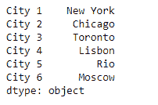
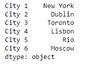
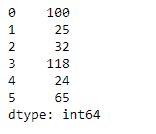
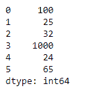

# Python | Pandas series . set _ value()

> 原文:[https://www . geesforgeks . org/python-pandas-series-set _ value/](https://www.geeksforgeeks.org/python-pandas-series-set_value/)

熊猫系列是带有轴标签的一维数组。标签不必是唯一的，但必须是可散列的类型。该对象支持基于整数和基于标签的索引，并提供了一系列方法来执行涉及索引的操作。

熊猫 `**Series.set_value()**`功能用于使用索引标签设置给定系列对象的值。

> **语法:** Series.set_value(标签，值，可带=False)
> 
> **参数:**
> **标签:**不允许使用多索引进行部分索引
> **值:**标量值
> **可获取:**将索引解释为索引器，默认为 False
> 
> **返回:**系列

**示例#1:** 使用`Series.set_value()`功能使用索引标签设置给定序列对象中的值。

```
# importing pandas as pd
import pandas as pd

# Creating the Series
sr = pd.Series(['New York', 'Chicago', 'Toronto', 'Lisbon', 'Rio', 'Moscow'])

# Create the Index
index_ = ['City 1', 'City 2', 'City 3', 'City 4', 'City 5', 'City 6']

# set the index
sr.index = index_

# Print the series
print(sr)
```

**输出:**



现在我们将使用`Series.set_value()`函数设置与传递的索引标签对应的值。

```
# set the value
sr.set_value('City 2', 'Dublin')
```

**输出:**


正如我们在输出中看到的，`Series.set_value()`函数已经成功设置了传递的索引标签的值。

**示例 2:** 使用`Series.set_value()`功能使用索引标签设置给定序列对象中的值。

```
# importing pandas as pd
import pandas as pd

# Creating the Series
sr = pd.Series([100, 25, 32, 118, 24, 65])

# Print the series
print(sr)
```

**输出:**



现在我们将使用`Series.set_value()`函数来设置给定序列对象中的值。

```
# set the value to 1000 of
# the passed index label
sr.set_value(3, 1000)
```

**输出:**



我们可以在输出中看到，`Series.set_value()`函数已经成功设置了传递的索引标签的值。