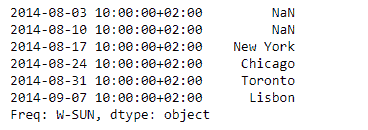
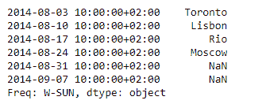

# 蟒蛇|熊猫系列. shift()

> 原文:[https://www.geeksforgeeks.org/python-pandas-series-shift/](https://www.geeksforgeeks.org/python-pandas-series-shift/)

熊猫系列是带有轴标签的一维数组。标签不必是唯一的，但必须是可散列的类型。该对象支持基于整数和基于标签的索引，并提供了一系列方法来执行涉及索引的操作。

熊猫 `**Series.shift()**`功能通过可选的时间频率将指数移动所需的周期数。当 freq 未通过时，移动索引而不重新排列数据。

> **语法:**序列。移位(周期=1，频率=无，轴=0，填充值=无)
> 
> **参数:**
> **周期:**要移位的周期数。可以是正的，也可以是负的。
> **频率:**从时间模块或时间规则中使用的偏移量(例如‘EOM’)
> **轴:**移动方向。
> **fill_value :** 用于新引入的缺失值的标量值
> 
> **返回:**输入对象的副本，移位。

**示例#1:** 使用`Series.shift()`功能将给定序列对象的数据移动 2 个周期。

```py
# importing pandas as pd
import pandas as pd

# Creating the Series
sr = pd.Series(['New York', 'Chicago', 'Toronto', 'Lisbon', 'Rio', 'Moscow'])

# Create the Datetime Index
didx = pd.DatetimeIndex(start ='2014-08-01 10:00', freq ='W', 
                     periods = 6, tz = 'Europe/Berlin') 

# set the index
sr.index = didx

# Print the series
print(sr)
```

**输出:**


现在我们将使用`Series.shift()`函数将给定序列对象中的数据移动 2 个周期。

```py
# shift by 2 periods
sr.shift(periods = 2)
```

**输出:**



正如我们在输出中看到的那样，`Series.shift()`函数已经成功地将数据转移到索引上。请注意，对应于最后两个索引的数据已被删除。

**示例#2:** 使用`Series.shift()`功能将给定序列对象的数据移动-2 个周期。

```py
# importing pandas as pd
import pandas as pd

# Creating the Series
sr = pd.Series(['New York', 'Chicago', 'Toronto', 'Lisbon', 'Rio', 'Moscow'])

# Create the Datetime Index
didx = pd.DatetimeIndex(start ='2014-08-01 10:00', freq ='W', 
                     periods = 6, tz = 'Europe/Berlin') 

# set the index
sr.index = didx

# Print the series
print(sr)
```

**输出:**


现在我们将使用`Series.shift()`函数将给定序列对象中的数据移动-2 个周期。

```py
# shift by -2 periods
sr.shift(periods = -2)
```

**输出:**



正如我们在输出中看到的那样，`Series.shift()`函数已经成功地将数据转移到索引上。请注意，前两个索引的数据已被删除。