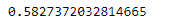
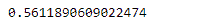

# 蟒蛇|熊猫系列. skew()

> 原文:[https://www.geeksforgeeks.org/python-pandas-series-skew/](https://www.geeksforgeeks.org/python-pandas-series-skew/)

熊猫系列是带有轴标签的一维数组。标签不必是唯一的，但必须是可散列的类型。该对象支持基于整数和基于标签的索引，并提供了一系列方法来执行涉及索引的操作。

熊猫 `**Series.skew()**`函数返回所请求轴上的无偏偏斜，归一化 N-1。偏斜度是统计分布中的不对称，其中曲线出现扭曲或向左或向右偏斜。

> **语法:**序列.偏斜(轴=无，skipna =无，级别=无，numeric _ only =无，**kwargs)
> 
> **参数:**
> **轴:**轴为要应用的功能。
> **skipna :** 计算结果时排除 NA/null 值。
> **级别:**如果轴是多索引(分层)，则沿着特定级别计数，折叠成标量。
> **numeric_only :** 只包括 float、int、boolean 列。
> ****kwargs :** 要传递给函数的附加关键字参数。
> 
> **返回:**偏斜:标量或级数(如果指定了级别)

**示例#1 :** 使用`Series.skew()`函数查找给定 Series 对象的数据中的偏斜度。

```
# importing pandas as pd
import pandas as pd

# Creating the Series
sr = pd.Series([100, 25, 32, 118, 24, 65])

# Print the series
print(sr)
```

**输出:**


现在我们将使用`Series.skew()`函数来查找数据中的偏斜度。

```
# find skewness
sr.skew()
```

**输出:**



正如我们在输出中看到的，`Series.skew()`函数已经成功地计算了给定 Series 对象的数据中的偏斜度。

**示例#2 :** 使用`Series.skew()`函数查找给定 Series 对象的数据中的偏斜度。我们的系列对象中有一些丢失的值，所以跳过这些丢失的值。

```
# importing pandas as pd
import pandas as pd

# Creating the Series
sr = pd.Series([19.5, 16.8, None, 22.78, None, 20.124, None, 18.1002, None])

# Print the series
print(sr)
```

**输出:**


现在我们将使用`Series.skew()`函数来查找数据中的偏斜度。

```
# find skewness
sr.skew(skipna = True)
```

**输出:**



正如我们在输出中看到的，`Series.skew()`函数已经成功地计算了给定 Series 对象的数据中的偏斜度。在计算给定数据的偏斜度时，已跳过缺失值。