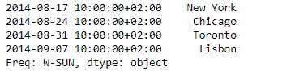
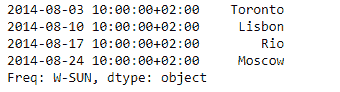

# Python | Pandas series . slice _ shift()

> 原文:[https://www . geesforgeks . org/python-pandas-series-slice _ shift/](https://www.geeksforgeeks.org/python-pandas-series-slice_shift/)

熊猫系列是带有轴标签的一维数组。标签不必是唯一的，但必须是可散列的类型。该对象支持基于整数和基于标签的索引，并提供了一系列方法来执行涉及索引的操作。

熊猫 `**Series.slice_shift()**`功能相当于不复制数据的移位。移位的数据将不包括丢失的周期，并且移位的轴将小于原始轴。

> **语法:** Series.slice_shift(周期=1，轴=0)
> 
> **参数:**
> **周期:**要移动的周期数，可以是正的也可以是负的
> 
> **返回:**移位:与调用者类型相同

**示例#1:** 使用`Series.slice_shift()`功能将给定序列对象的数据移动 2 个周期。

```py
# importing pandas as pd
import pandas as pd

# Creating the Series
sr = pd.Series(['New York', 'Chicago', 'Toronto', 'Lisbon', 'Rio', 'Moscow'])

# Create the Datetime Index
didx = pd.DatetimeIndex(start ='2014-08-01 10:00', freq ='W', 
                     periods = 6, tz = 'Europe/Berlin') 

# set the index
sr.index = didx

# Print the series
print(sr)
```

**输出:**


现在我们将使用`Series.slice_shift()`函数将给定序列对象中的数据移动 2 个周期。

```py
# shift by 2 periods
sr.slice_shift(periods = 2)
```

**输出:**



正如我们在输出中看到的那样，`Series.slice_shift()`函数已经成功地将数据转移到索引上。请注意，前两个索引标签已被删除。

**示例 2:** 使用`Series.slice_shift()`功能将给定序列对象的数据移动-2 个周期。

```py
# importing pandas as pd
import pandas as pd

# Creating the Series
sr = pd.Series(['New York', 'Chicago', 'Toronto', 'Lisbon', 'Rio', 'Moscow'])

# Create the Datetime Index
didx = pd.DatetimeIndex(start ='2014-08-01 10:00', freq ='W', 
                     periods = 6, tz = 'Europe/Berlin') 

# set the index
sr.index = didx

# Print the series
print(sr)
```

**输出:**


现在我们将使用`Series.slice_shift()`函数将给定序列对象中的数据移动-2 个周期。

```py
# shift by -2 periods
sr.slice_shift(periods = -2)
```

**输出:**



正如我们在输出中看到的那样，`Series.slice_shift()`函数已经成功地将数据转移到索引上。请注意，最后两个索引标签被删除，数据被上移。