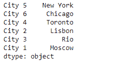
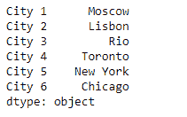
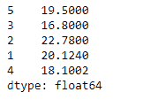
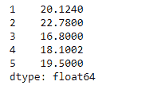

# Python | Pandas series . sort _ index()

> 原文:[https://www . geesforgeks . org/python-pandas-series-sort _ index/](https://www.geeksforgeeks.org/python-pandas-series-sort_index/)

熊猫系列是带有轴标签的一维数组。标签不必是唯一的，但必须是可散列的类型。该对象支持基于整数和基于标签的索引，并提供了一系列方法来执行涉及索引的操作。

Pandas `**Series.sort_index()**`功能用于给定系列对象的索引标签排序。

> **语法:** Series.sort_index(axis=0，level=None，升序=True，inplace=False，kind='quicksort '，na_position='last '，sort_remaining=True)
> 
> **参数:**
> **轴:**轴来直接排序。对于系列只能为 0。
> **级别:**如果不是“无”，则对指定索引级别的值进行排序。
> **升序:**排序升序对降序。
> **到位:**如果为真，就地操作。
> **种类:**排序算法的选择。
> **na _ position:**Argument“first”将 NaNs 放在开头，“last”将 NaNs 放在结尾。
> **sort_remaining :** 如果为真，并且按级别和索引排序是多级的，则按指定级别排序后，也按其他级别排序(按顺序)。
> 
> **返回:**系列

**示例#1:** 使用`Series.sort_index()`函数对给定系列对象的索引标签进行排序。

```py
# importing pandas as pd
import pandas as pd

# Creating the Series
sr = pd.Series(['New York', 'Chicago', 'Toronto', 'Lisbon', 'Rio', 'Moscow'])

# Create the Index
index_ = ['City 5', 'City 6', 'City 4', 'City 2', 'City 3', 'City 1'] 

# set the index
sr.index = index_

# Print the series
print(sr)
```

**输出:**



现在我们将使用`Series.sort_index()`函数对给定序列对象的索引标签进行排序。

```py
# sort the index labels
sr.sort_index()
```

**输出:**



正如我们在输出中看到的，`Series.sort_index()`函数已经成功地对给定序列对象的索引标签进行了排序。

**示例 2:** 使用`Series.sort_index()`函数对给定系列对象的索引标签进行排序。

```py
# importing pandas as pd
import pandas as pd

# Creating the Series
sr = pd.Series([19.5, 16.8, 22.78, 20.124, 18.1002])

# Create the Index
index_ = [5, 3, 2, 1, 4]

# set the index
sr.index = index_

# Print the series
print(sr)
```

**输出:**



现在我们将使用`Series.sort_index()`函数对给定序列对象的索引标签进行排序。

```py
# sort the index labels
sr.sort_index()
```

**输出:**



正如我们在输出中看到的，`Series.sort_index()`函数已经成功地对给定序列对象的索引标签进行了排序。