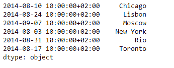
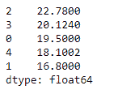

# Python | Pandas series . sort _ values()

> 原文:[https://www . geesforgeks . org/python-pandas-series-sort _ values/](https://www.geeksforgeeks.org/python-pandas-series-sort_values/)

熊猫系列是带有轴标签的一维数组。标签不必是唯一的，但必须是可散列的类型。该对象支持基于整数和基于标签的索引，并提供了一系列方法来执行涉及索引的操作。

Pandas `**Series.sort_values()**`功能用于按照某种标准对给定的序列对象进行升序或降序排序。该函数还提供了选择排序算法的灵活性。

> **语法:** Series.sort_values(axis=0，升序=True，inplace=False，kind='quicksort '，na_position='last ')
> 
> **参数:**
> **轴:**轴来直接排序。
> **升序:**如果为真，则按升序排序，否则按降序排序。
> **就位:**如果为真，就地操作。
> **种类:**排序算法的选择。
> **na _ position:**Argument“first”将 NaNs 放在开头，“last”将 NaNs 放在结尾。
> 
> **返回:**系列

**示例#1:** 使用`Series.sort_values()`函数按照字典顺序对给定序列对象的元素进行排序。

```py
# importing pandas as pd
import pandas as pd

# Creating the Series
sr = pd.Series(['New York', 'Chicago', 'Toronto', 'Lisbon', 'Rio', 'Moscow'])

# Create the Datetime Index
didx = pd.DatetimeIndex(start ='2014-08-01 10:00', freq ='W', 
                     periods = 6, tz = 'Europe/Berlin') 

# set the index
sr.index = didx

# Print the series
print(sr)
```

**输出:**


现在我们将使用`Series.sort_values()`函数对给定序列对象的元素进行升序排序。

```py
# sort the values in ascending order
sr.sort_values()
```

**输出:**



正如我们在输出中看到的，`Series.sort_values()`函数已经成功地按升序对给定序列对象的元素进行了排序。

**例 2:** 使用`Series.sort_values()`函数对给定序列对象的元素进行降序排序。

```py
# importing pandas as pd
import pandas as pd

# Creating the Series
sr = pd.Series([19.5, 16.8, 22.78, 20.124, 18.1002])

# Print the series
print(sr)
```

**输出:**


现在我们使用`Series.sort_values()`函数对给定序列对象的元素进行降序排序。

```py
# sort the values in descending order
sr.sort_values(ascending = False)
```

**输出:**



正如我们在输出中看到的，`Series.sort_values()`函数已经成功地按降序对给定序列对象的元素进行了排序。