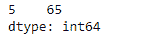
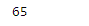

# 蟒蛇|熊猫系列.挤压()

> 原文:[https://www.geeksforgeeks.org/python-pandas-series-squeeze/](https://www.geeksforgeeks.org/python-pandas-series-squeeze/)

Python 是进行数据分析的优秀语言，主要是因为以数据为中心的 python 包的奇妙生态系统。 ***【熊猫】*** 就是其中一个包，让导入和分析数据变得容易多了。

熊猫系列是带有轴标签的一维数组。标签不必是唯一的，但必须是可散列的类型。该对象支持基于整数和基于标签的索引，并提供了一系列方法来执行涉及索引的操作。

熊猫 `**Series.squeeze()**`功能将一维轴对象挤压成标量。具有单个元素的系列或数据帧被压缩为一个标量。具有单列或单行的数据帧被压缩为一个系列。否则对象不变。

> **语法:**系列。挤压(轴=无)
> 
> **参数:**
> **轴:**一个特定的轴进行挤压。默认情况下，所有长度为 1 的轴都会被挤压。
> 
> **返回:**挤压轴或所有轴后的投影。

**示例#1 :** 使用`Series.squeeze()`函数将给定序列的单个元素压缩为标量。

```
# importing pandas as pd
import pandas as pd

# Creating the Series
sr = pd.Series([100, 25, 32, 118, 24, 65])

# Print the series
print(sr)
```

**输出:**


让我们变换级数，使它只包含那些能被 13 整除的元素。

```
# Keep only those elements which are divisible by 13
sr_temp = sr[sr % 13 == 0]

# Let's print the series
print(sr_temp)
```

**输出:**



现在我们将使用`Series.squeeze()`函数将给定的级数对象简化为标量。

```
# squeeze the series to scalar
sr_temp.squeeze()
```

**输出:**

正如我们在输出中所看到的，`Series.squeeze()`函数已经成功地将给定的序列简化为一个标量。

**例 2 :** 使用`Series.squeeze()`功能挤压给定的序列对象。

```
# importing pandas as pd
import pandas as pd

# Creating the Series
sr = pd.Series([19.5, 16.8, None, 22.78, None, 20.124, None, 18.1002, None])

# Print the series
print(sr)
```

**输出:**


现在我们将使用`Series.std()`函数来挤压给定的序列对象。

```
# squeeze the series to scalar
sr_temp.squeeze()
```

**输出:**


正如我们在输出中看到的那样，`Series.squeeze()`函数返回了相同的序列对象，因为在给定的序列对象中有多个元素，因此它不能被压缩为标量值。