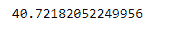
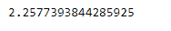

# 蟒蛇|熊猫系列. std()

> 原文:[https://www.geeksforgeeks.org/python-pandas-series-std/](https://www.geeksforgeeks.org/python-pandas-series-std/)

熊猫系列是带有轴标签的一维数组。标签不必是唯一的，但必须是可散列的类型。该对象支持基于整数和基于标签的索引，并提供了一系列方法来执行涉及索引的操作。

熊猫 `**Series.std()**`功能返回要求轴上的样本标准偏差。默认情况下，标准偏差由 N-1 归一化。这可以使用 ddof 参数进行更改。

> **语法:**series . STD(axis =无，skipna =无，level =无，ddof=1，numeric _ only =无，**kwargs)
> 
> **参数:**
> **轴:**{ index(0)}
> **skipna:**排除 NA/null 值。如果整行/整列是 NA，结果将是 NA
> **级别:**如果轴是多索引(分层)，沿特定级别计数，折叠成标量
> **ddof:**δ自由度。计算中使用的除数是 N–ddof，其中 N 代表元素的数量。
> **仅限数值:**布尔值，默认无
> 
> **返回:**标准:标量或序列(如果指定了级别)

**示例#1 :** 使用`Series.std()`函数找到给定序列对象的标准偏差。

```
# importing pandas as pd
import pandas as pd

# Creating the Series
sr = pd.Series([100, 25, 32, 118, 24, 65])

# Print the series
print(sr)
```

**输出:**


现在我们用`Series.std()`函数求给定 Series 对象的标准差。

```
# find standard-deviation along the
# 0th index
sr.std()
```

**输出:**



正如我们在输出中看到的，`Series.std()`函数已经成功地计算了给定 Series 对象的标准偏差。

**例 2 :** 使用`Series.std()`函数求给定 Series 对象的标准差。我们的系列对象中有一些丢失的值，所以跳过这些丢失的值。

```
# importing pandas as pd
import pandas as pd

# Creating the Series
sr = pd.Series([19.5, 16.8, None, 22.78, None, 20.124, None, 18.1002, None])

# Print the series
print(sr)
```

**输出:**


现在我们用`Series.std()`函数求给定 Series 对象的标准差。

```
# find standard-deviation along the
# 0th index
sr.std(skipna = True)
```

**输出:**



正如我们在输出中看到的，`Series.std()`函数已经成功地计算了给定 Series 对象的标准偏差。如果我们不跳过缺失的值，那么输出将是`NaN`。