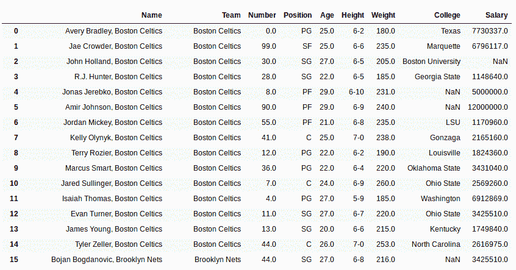
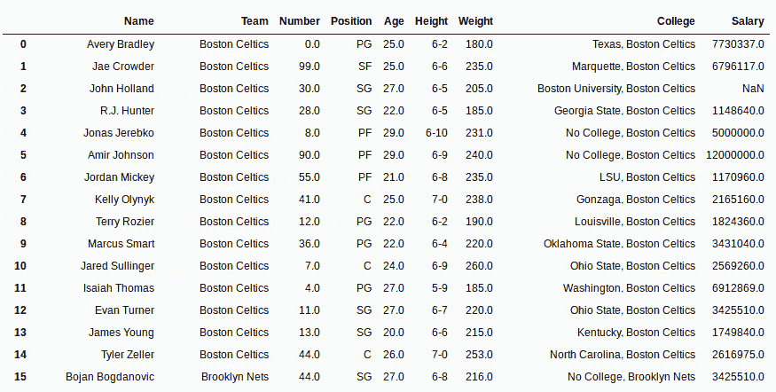

# Python | Pandas Series.str.cat()连接字符串

> 原文:[https://www . geesforgeks . org/python-pandas-series-str-cat-to-concatenate-string/](https://www.geeksforgeeks.org/python-pandas-series-str-cat-to-concatenate-string/)

Python 是进行数据分析的优秀语言，主要是因为以数据为中心的 python 包的奇妙生态系统。 ***【熊猫】*** 就是其中一个包，让导入和分析数据变得容易多了。
Pandas **str.cat()** 用于将字符串连接到传递的调用者字符串系列。可以传递不同系列的不同值，但两个系列的长度必须相同。 ***。str*** 必须加上前缀，以区别于 Python 的默认方法。

> **语法:** Series.str.cat(others=None，sep=None，na_rep=None)
> **参数:**
> **others:** Series，index，数据框或字符串列表要连接的字符串
> **sep** :要放在两个字符串之间的分隔符
> **na_rep:** None 或字符串值要替换为空值的字符串值
> **返回类型:** Series 与连接的字符串值

要下载使用的 Csv 文件，点击这里的[。](https://media.geeksforgeeks.org/wp-content/uploads/nba.csv)
在下面的例子中，使用的数据框包含了一些 NBA 球员的数据。任何操作前的数据框图像附在下面。


**示例#1:** 用分隔符连接列
在此示例中，团队列在名称列的末尾用分隔符“，”连接。名称列将被新系列覆盖，然后显示数据框。

## 蟒蛇 3

```py
# importing pandas module
import pandas as pd

# importing csv from link
data = pd.read_csv("https://media.geeksforgeeks.org/wp-content/uploads/nba.csv")

# making copy of team column
new = data["Team"].copy()

# concatenating team with name column
# overwriting name column
data["Name"]= data["Name"].str.cat(new, sep =", ")

# display
data
```

**输出:**
如输出图像所示，Team 列中索引与 Name 列中的字符串相同的每个字符串都用分隔符“，”连接在一起。



**例 2:** 处理空值
分析数据最重要的部分就是处理空值。str.cat()提供了一种通过 na_rep 参数处理 null 值的方法。传递给该参数的内容将在每次出现空值时被替换。
在本例中，学院列与团队列串联。将“无学院”传递给 na_rep 参数，用此字符串替换 null。

## 蟒蛇 3

```py
# importing pandas module
import pandas as pd

# importing csv from link
data = pd.read_csv("https://media.geeksforgeeks.org/wp-content/uploads/nba.csv")

# making copy of team column
new = data["Team"].copy()

# string to replace null values with
na_string ="No College"

# concatenating team with name column
# overwriting name column
data["College"]= data["College"].str.cat(new, sep =", ", na_rep = na_string)

# display
data
```

**输出:**
在数据框中可以看到，在索引位置 4 和 5，有一个空值，该值已被替换为“无学院”，来自团队列的字符串已成功连接。

