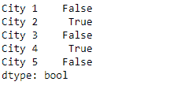
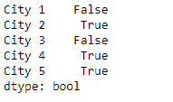

# Python | Pandas series . str . contains()

> 原文:[https://www . geesforgeks . org/python-pandas-series-str-contains/](https://www.geeksforgeeks.org/python-pandas-series-str-contains/)

Series.str 可用于以字符串形式访问系列的值，并对其应用几种方法。pandas**Series . str . contains()**函数用于测试模式或正则表达式是否包含在 Series 或 Index 的字符串中。该函数根据给定的模式或正则表达式是否包含在序列或索引的字符串中来返回布尔序列或索引。

> **语法:** Series.str.contains(pat，case=True，flags=0，na=nan，regex=True)
> **参数:**
> **pat :** 字符序列或正则表达式。
> **大小写:**如果为真，区分大小写。
> **标志:**传递到 re 模块的标志，例如 re . ignorecase .
> **na:**为缺失值填充值。
> **正则表达式:**如果为真，则假设 pat 是正则表达式。
> **返回:**布尔值系列或索引

**示例#1:** 使用 Series.str.contains()函数来查找给定序列对象中基础数据的字符串中是否存在模式。

## 蟒蛇 3

```
# importing pandas as pd
import pandas as pd

# importing re for regular expressions
import re

# Creating the Series
sr = pd.Series(['New_York', 'Lisbon', 'Tokyo', 'Paris', 'Munich'])

# Creating the index
idx = ['City 1', 'City 2', 'City 3', 'City 4', 'City 5']

# set the index
sr.index = idx

# Print the series
print(sr)
```

**输出:**


现在我们将使用 Series.str.contains()函数来查找给定 Series 对象的基础数据中的字符串是否包含模式。

## 蟒蛇 3

```
# find if 'is' substring is present
result = sr.str.contains(pat = 'is')

# print the result
print(result)
```

**输出:**



正如我们在输出中看到的，Series.str.contains()函数返回了一系列布尔值对象。如果传递的模式出现在字符串中，则为真，否则返回假。
**示例#2:** 使用 Series.str.contains()函数来查找给定序列对象中基础数据的字符串中是否存在模式。使用正则表达式查找字符串中的模式。

## 蟒蛇 3

```
# importing pandas as pd
import pandas as pd

# importing re for regular expressions
import re

# Creating the Series
sr = pd.Series(['Mike', 'Alessa', 'Nick', 'Kim', 'Britney'])

# Creating the index
idx = ['Name 1', 'Name 2', 'Name 3', 'Name 4', 'Name 5']

# set the index
sr.index = idx

# Print the series
print(sr)
```

**输出:**


现在我们将使用 Series.str.contains()函数来查找给定 Series 对象的基础数据中的字符串是否包含模式。

## 蟒蛇 3

```
# find if there is a substring such that it has
# the letter 'i' followed by any small alphabet.
result = sr.str.contains(pat = 'i[a-z]', regex = True)

# print the result
print(result)
```

**输出:**



正如我们在输出中看到的，Series.str.contains()函数返回了一系列布尔值对象。如果传递的模式出现在字符串中，则为真，否则返回假。