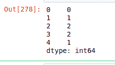
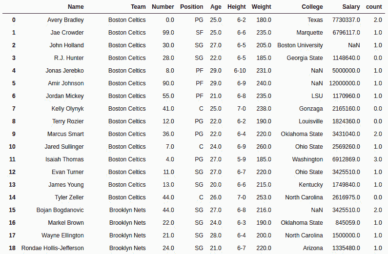

# Python | Pandas series . str . count()

> 原文:[https://www . geesforgeks . org/python-pandas-series-str-count/](https://www.geeksforgeeks.org/python-pandas-series-str-count/)

Python 是进行数据分析的优秀语言，主要是因为以数据为中心的 Python 包的奇妙生态系统。 ***【熊猫】*** 就是其中一个包，让导入和分析数据变得容易多了。

熊猫 **`str.count()`** 方法用于统计一个字符串或正则表达式模式在一个系列的每个字符串中的出现次数。还可以传递额外的标志参数来修改[正则表达式](https://www.geeksforgeeks.org/regular-expression-python-examples-set-1/)的某些方面，如区分大小写、多行匹配等。

因为这是熊猫弦法，所以只适用于系列弦和 ***。str*** 在每次调用这个方法之前都必须加上前缀。否则，它会给出一个错误。

> **语法:** Series.str.count(pat，flags=0)
> 
> **参数:**
> **pat:** 要在串联出现的字符串中搜索的字符串或正则表达式
> **标志:**可以传递的正则表达式标志(A，S，L，M，I，X)，默认值为 0，表示无。对于这个正则表达式模块(re)也必须导入。
> 
> **返回类型:**每个字符串中传递字符出现次数的系列。

要下载代码中使用的 CSV，点击这里的[。](https://media.geeksforgeeks.org/wp-content/uploads/nba.csv)

在下面的例子中，使用的数据框包含了一些 NBA 球员的数据。任何操作前的数据框图像附在下面。


**例#1:** 计算单词出现次数
在本例中，Pandas 系列由列表组成，使用 str.count()方法计算 gfg 的出现次数。

```
# importing pandas package
import pandas as pd

# making list
list =["GeeksforGeeks", "Geeksforgeeks", "geeksforgeeks",
       "geeksforgeeks is a great platform", "for tech geeks"]

# making series
series = pd.Series(list)

# counting occurrence of geeks
count = series.str.count("geeks")

# display
count
```

**输出:**
如输出图像所示，显示了每个字符串中极客的出现，由于第一个大写字母，极客没有被计算在内。


**示例 2:** 使用旗帜

在本例中，“a”出现在“名称”列中。标志参数也被使用并重新设置。我被传递给它，这意味着 IGNORECASE。因此，A 和 A 都将在计数过程中考虑。

```
# importing pandas module 
import pandas as pd

# importing module for regex
import re

# reading csv file from url 
data = pd.read_csv("https://media.geeksforgeeks.org/wp-content/uploads/nba.csv")

# String to be searched in start of string 
search ="a"

# count of occurrence of a and creating new column
data["count"]= data["Name"].str.count(search, re.I)

# display
data
```

**输出:**
如输出图像所示，通过查看第一个索引本身可以清楚地进行比较，Avery Bradely 中 a 的计数为 2，这意味着同时考虑了大写和小写。
