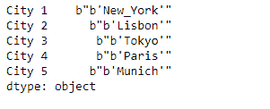
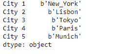
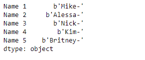
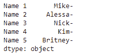

# Python | Pandas series . str . decode()

> 原文:[https://www . geesforgeks . org/python-pandas-series-str-decode/](https://www.geeksforgeeks.org/python-pandas-series-str-decode/)

`Series.str`可用于以字符串形式访问系列的值，并对其应用多种方法。熊猫 `**Series.str.decode()**`功能用于使用指定的编码对序列/索引中的字符串进行解码。这个功能相当于 python2 中的`str.decode()`和 python3 中的`bytes.decode()`。

> **语法:** Series.str.decode(编码，错误='strict ')
> 
> **参数:**
> **编码:** str
> **错误:** str，可选
> 
> **返回:**解码的对象序列/索引

**示例#1:** 使用`Series.str.decode()`函数解码给定序列对象的基础数据中的字符串。使用“UTF-8”编码方法。

```
# importing pandas as pd
import pandas as pd

# Creating the Series
sr = pd.Series([b"b'New_York'", b"b'Lisbon'", b"b'Tokyo'", b"b'Paris'", b"b'Munich'"])

# Creating the index
idx = ['City 1', 'City 2', 'City 3', 'City 4', 'City 5']

# set the index
sr.index = idx

# Print the series
print(sr)
```

**输出:**



现在我们将使用`Series.str.decode()`函数来解码给定序列对象的底层数据中的字符串。

```
# use 'UTF-8' encoding
result = sr.str.decode(encoding = 'UTF-8')

# print the result
print(result)
```

**输出:**



正如我们在输出中看到的那样，`Series.str.decode()`函数已经成功解码了给定序列对象的底层数据中的字符串。

**示例#2 :** 使用`Series.str.decode()`函数对给定序列对象的底层数据中的字符串进行解码。使用“ASCII”编码方法。

```
# importing pandas as pd
import pandas as pd

# Creating the Series
sr = pd.Series([b'Mike-', b'Alessa-', b'Nick-', b'Kim-', b'Britney-'])

# Creating the index
idx = ['Name 1', 'Name 2', 'Name 3', 'Name 4', 'Name 5']

# set the index
sr.index = idx

# Print the series
print(sr)
```

**输出:**



现在我们将使用`Series.str.decode()`函数来解码给定序列对象的底层数据中的字符串。

```
# use 'ASCII' encoding
result = sr.str.decode(encoding = 'ASCII')

# print the result
print(result)
```

**输出:**



正如我们在输出中看到的那样，`Series.str.decode()`函数已经成功解码了给定序列对象的底层数据中的字符串。