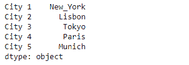
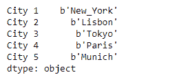
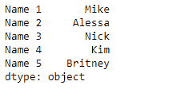
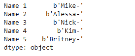

# Python | Pandas series . str . encode()

> 原文:[https://www . geesforgeks . org/python-pandas-series-str-encode/](https://www.geeksforgeeks.org/python-pandas-series-str-encode/)

`Series.str`可用于以字符串形式访问系列的值，并对其应用多种方法。熊猫 `**Series.str.encode()**`功能用于使用指定的编码对序列/索引中的字符串进行编码。相当于`str.encode()`。

> **语法:** Series.str.encode(编码，错误='strict ')
> 
> **参数:**
> **编码:** str
> **错误:** str，可选
> 
> **返回:**编码:对象的系列/索引

**示例#1:** 使用`Series.str.encode()`函数对给定序列对象的基础数据中存在的字符串进行编码。使用“raw_unicode_escape”进行编码。

```
# importing pandas as pd
import pandas as pd

# Creating the Series
sr = pd.Series(['New_York', 'Lisbon', 'Tokyo', 'Paris', 'Munich'])

# Creating the index
idx = ['City 1', 'City 2', 'City 3', 'City 4', 'City 5']

# set the index
sr.index = idx

# Print the series
print(sr)
```

**输出:**



现在我们将使用`Series.str.encode()`函数对给定序列对象的底层数据中存在的字符串进行编码。

```
# use 'raw_unicode_escape' encoding
result = sr.str.encode(encoding = 'raw_unicode_escape')

# print the result
print(result)
```

**输出:**



正如我们在输出中看到的那样，`Series.str.encode()`函数已经成功地对给定序列对象中的字符串进行了编码。

**示例#2 :** 使用`Series.str.encode()`函数对给定序列对象的基础数据中存在的字符串进行编码。使用“punycode”进行编码。

```
# importing pandas as pd
import pandas as pd

# Creating the Series
sr = pd.Series(['Mike', 'Alessa', 'Nick', 'Kim', 'Britney'])

# Creating the index
idx = ['Name 1', 'Name 2', 'Name 3', 'Name 4', 'Name 5']

# set the index
sr.index = idx

# Print the series
print(sr)
```

**输出:**



现在我们将使用`Series.str.encode()`函数对给定序列对象的底层数据中存在的字符串进行编码。

```
# use 'punycode' encoding
result = sr.str.encode(encoding = 'punycode')

# print the result
print(result)
```

**输出:**



正如我们在输出中看到的那样，`Series.str.encode()`函数已经成功地对给定序列对象中的字符串进行了编码。