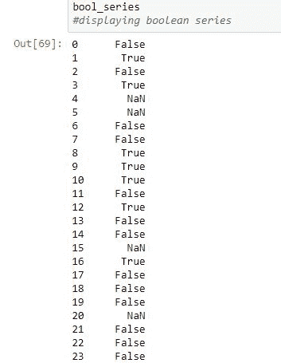
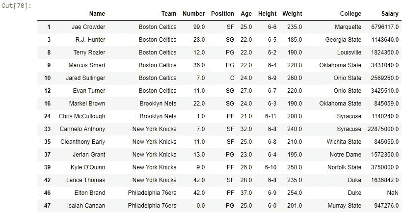

# Python | Pandas series . str . endswith()

> 原文:[https://www . geesforgeks . org/python-pandas-series-str-end swith/](https://www.geeksforgeeks.org/python-pandas-series-str-endswith/)

Python 是进行数据分析的优秀语言，主要是因为以数据为中心的 Python 包的奇妙生态系统。Pandas 就是其中之一，它让数据的导入和分析变得更加容易。

熊猫 **`endswith()`** 是另一种在序列或数据框中搜索和过滤文本数据的方法。这个方法类似于 Python 的 [endswith()](https://www.geeksforgeeks.org/string-endswith-python/) 方法，但是有不同的参数，它只适用于熊猫对象。遂 ***。str*** 每次调用这个方法之前都要加上前缀，这样编译器就知道它和默认函数不一样了。

> **语法:** Series.str.endswith(pat，na=nan)
> 
> **参数:**
> **拍:**待搜索字符串。不接受正则表达式
> **na:** 用于设置当序列中的值为空时应该显示什么。
> 
> **返回类型:**布尔级数，当值最后有传递的字符串时为真。

要下载代码中使用的 CSV，点击这里的[。](https://media.geeksforgeeks.org/wp-content/uploads/nba.csv)

在下面的例子中，使用的数据框包含了一些 NBA 球员的数据。任何操作前的数据框图像附在下面。


**示例#1:** 返回 Bool 系列
在此示例中，使用`**str.endswith()**`函数检查学院列中的元素在字符串末尾是否有“e”。返回一个布尔序列，在字符串末尾有“e”的索引位置为真。`str.lower()` 方法在 endswith()之前调用，因为数据在任何情况下都可以是。

```
# importing pandas module 
import pandas as pd

# reading csv file from url 
data = pd.read_csv("https://media.geeksforgeeks.org/wp-content/uploads/nba.csv")

# String to be searched in end of string 
search ="e"

# boolean series returned with False at place of NaN
bool_series = data["College"].str.lower().str.endswith(search)

# displaying boolean series
bool_series
```

**输出:**
如输出图像所示，布尔序列在学院列最后有“e”的索引位置有“真”。也可以通过查看原始数据帧的图像进行比较。


**示例 2:** 处理空值

数据分析中最重要的部分是处理空值。从上面的输出图像中可以看出，无论学院列中的值是空的还是 NaN，布尔序列都有 NaN。如果这个布尔序列被传递到数据框中，它会给出一个错误。因此，需要使用 *na* 参数来处理 NaN 值。它也可以设置为 string，但是由于 bool 系列用于传递和返回各自的值，因此应该只设置为 Bool 值。
在本例中， *na* 参数设置为假。因此，无论学院列有空值，布尔系列都将存储 False，而不是 NaN。之后，序列再次传递到数据框，只显示真值。

```
# importing pandas module 
import pandas as pd

# reading csv file from url 
data = pd.read_csv("https://media.geeksforgeeks.org/wp-content/uploads/nba.csv")

# String to be searched in end of string 
search ="e"

# boolean series returned with False at place of NaN
bool_series = data["College"].str.lower().str.endswith(search, na = False)

# displaying filtered dataframe
data[bool_series]
```

**输出:**
如输出图像所示，数据框中的行在 College 列的字符串末尾有“e”。由于 na 参数设置为 False，因此不显示 NaN 值。
