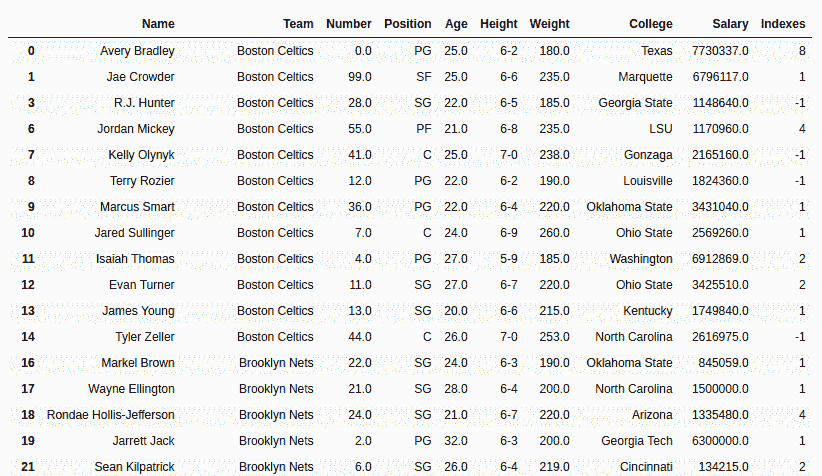
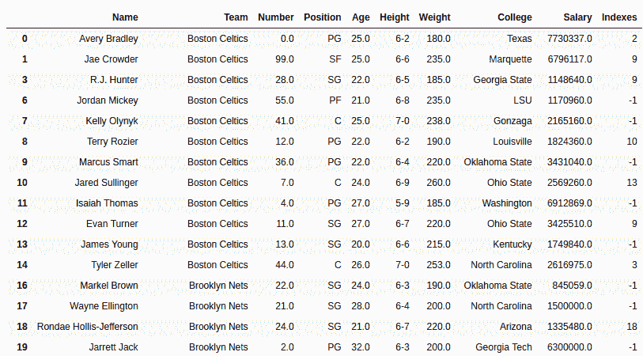

# Python | Pandas series . str . find()

> 原文:[https://www . geesforgeks . org/python-pandas-series-str-find/](https://www.geeksforgeeks.org/python-pandas-series-str-find/)

Python 是进行数据分析的优秀语言，主要是因为以数据为中心的 python 包的奇妙生态系统。 ***【熊猫】*** 就是其中一个包，让导入和分析数据变得容易多了。
Pandas **str.find()** 方法用于搜索序列中出现的每个字符串中的子字符串。如果找到该字符串，则返回其出现的**最低索引。**如果没有找到字符串，将返回-1。
也可以传递起点和终点，在字符串的特定部分搜索传递的字符或子字符串。

> **语法:** Series.str.find(sub，start=0，end=None)
> **参数:**
> **sub:** 要在文本值中搜索的字符串或字符在 series
> **中开始:** int 值，搜索的起始点。默认值为 0，表示从字符串
> **开始到:** int 值结束，需要停止搜索的结束点。默认值为无。
> **返回类型:**子串出现的索引位置为
> 的序列

要下载代码中使用的 CSV，点击这里的[。](https://media.geeksforgeeks.org/wp-content/uploads/nba.csv)
在下面的例子中，使用的数据框包含了一些 NBA 球员的数据。任何操作前的数据框图像附在下面。


**示例#1:** 查找单个字符
在本例中，使用 str.find()方法在 Name 列的每个字符串中搜索单个字符“a”。开始和结束参数保持默认值。返回的序列存储在一个新的列中，以便可以通过直接查看来比较索引。在应用此方法之前，使用。dropna()以避免错误。

## 蟒蛇 3

```
# importing pandas module
import pandas as pd

# reading csv file from url
data = pd.read_csv("https://media.geeksforgeeks.org/wp-content/uploads/nba.csv")

# dropping null value columns to avoid errors
data.dropna(inplace = True)

# substring to be searched
sub ='a'

# creating and passing series to new column
data["Indexes"]= data["Name"].str.find(sub)

# display
data
```

**输出:**
如输出图像所示，“索引”列中出现的索引等于字符串中第一个出现字符的位置。如果文本中不存在子字符串，则返回-1。通过查看第一行本身也可以看出，没有考虑“A”，这证明该方法区分大小写。



**例#2:** 搜索子串(一个以上字符)
在本例中，数据框的 Name 列中会搜索到‘er’子串。start 参数保持为 2，从第 3 个(索引位置 2)元素开始搜索。

## 蟒蛇 3

```
# importing pandas module
import pandas as pd

# reading csv file from url
data = pd.read_csv("https://media.geeksforgeeks.org/wp-content/uploads/nba.csv")

# dropping null value columns to avoid errors
data.dropna(inplace = True)

# substring to be searched
sub ='er'

# start var
start = 2

# creating and passing series to new column
data["Indexes"]= data["Name"].str.find(sub, start)

# display
data
```

**输出:**
如输出图像所示，返回子串出现的最小索引。但是可以看到，在特里·罗齐尔的情况下(数据帧中的第 9 行)，不是第一次出现“er”，而是返回了 10。这是因为 start 参数保持为 2，第一个“er”出现在此之前。

