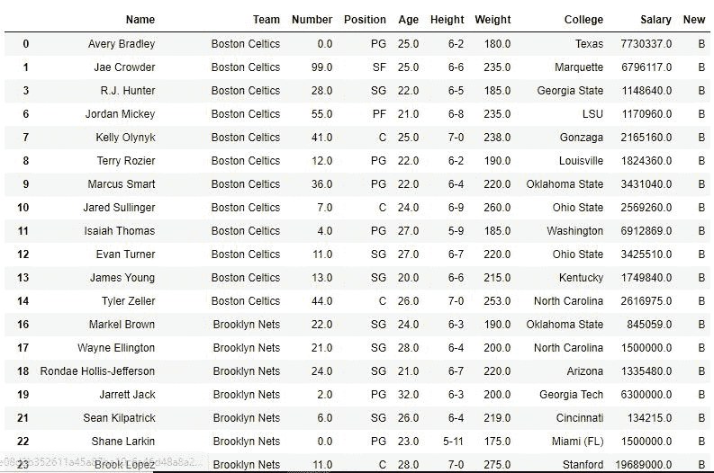
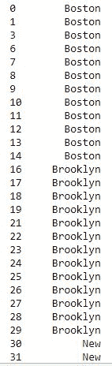
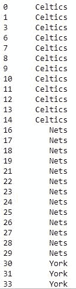

# Python | Pandas series . str . get()

> 原文:[https://www.geeksforgeeks.org/python-pandas-series-str-get/](https://www.geeksforgeeks.org/python-pandas-series-str-get/)

Python 是进行数据分析的优秀语言，主要是因为以数据为中心的 python 包的奇妙生态系统。 ***【熊猫】*** 就是其中一个包，让导入和分析数据变得容易多了。

熊猫 **str.get()** 方法用于获取经过位置的元素**。**该方法适用于整个系列中的字符串、数值甚至列表。 ***。str*** 每次都要加前缀，以区别于 Python 默认的 [get()](https://www.geeksforgeeks.org/get-method-dictionaries-python/) 方法。

> **语法:** Series.str.get(i)
> 
> **参数:**
> **i :** 待提取元素的位置，仅限整数值。
> 
> **返回类型:**元素/字符在传递位置的序列

要下载代码中使用的 CSV，点击这里的。

在下面的例子中，使用的数据框包含了一些 NBA 球员的数据。任何操作前的数据框图像附在下面。


**示例#1:** 从字符串值中获取字符

在本例中， ***str.get()*** 方法用于从名称列中获取单个字符。使用 [dropna()](https://www.geeksforgeeks.org/python-pandas-dataframe-dropna/) 方法删除了 *null* 值，在应用该方法之前，使用`.astype()`将该系列转换为字符串类型系列。这个方法可以用来获取一个字符而不是整个字符串。例如，从男性获得 M，从女性获得 F，因为只能有两个输入，所以这样做可以保存数据。

```
# importing pandas module 
import pandas as pd

# reading csv file from url 
data = pd.read_csv("https://media.geeksforgeeks.org/wp-content/uploads/nba.csv")

# dropping null value columns to avoid errors
data.dropna(inplace = True)

# converting to string series
data["Name"]= data["Name"].astype(str)

# creating new column with element at 0th position in data["Team"]
data["New"]= data["Name"].str.get(0)

data
# display
```

**输出:**
如输出图像所示，New 列在 Name 列中有字符串的第一个字母。

**例 2:** 从列表系列中获取元素

在本例中，使用 ***str.split()*** 方法，团队列在每次出现" "(空白)时都被拆分为一个列表。然后用它覆盖同一列。之后使用 *str.get()* 方法获取列表中通过索引的元素。

```
# importing pandas module 
import pandas as pd

# reading csv file from url 
data = pd.read_csv("https://media.geeksforgeeks.org/wp-content/uploads/nba.csv")

# dropping null value columns to avoid errors
data.dropna(inplace = True)

# converting to string series
data["Team"]= data["Team"].astype(str)

# splitting at occurrence of whitespace
data["Team"]= data["Team"].str.split(" ", 1)

# displaying first element from list
data["Team"].str.get(0)

# displaying second element from list
data["Team"].str.get(1)
```

**输出:**
如输出图像所示，第一个图像是系列中第 0 个位置的元素，第二个图像是系列中第 1 个位置的元素。

**输出 1: `data["Team"].str.get(0)`**


**输出 2: `data["Team"].str.get(1)`**
