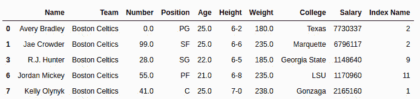

# Python | Pandas series . str . index()

> 原文:[https://www . geesforgeks . org/python-pandas-series-str-index/](https://www.geeksforgeeks.org/python-pandas-series-str-index/)

Python 是进行数据分析的优秀语言，主要是因为以数据为中心的 Python 包的奇妙生态系统。 ***【熊猫】*** 就是其中一个包，让导入和分析数据变得容易多了。

Pandas **`str.index()`** 方法用于搜索并返回序列中每个字符串的特定部分(开始和结束之间)的子字符串的最低索引。此方法的工作方式类似于 [str.find()](https://www.geeksforgeeks.org/python-pandas-series-str-find/) 但在未找到的情况下，str.index()给出的不是-1，而是一个 ValueError。

> **语法:** Series.str.index(sub，start=0，end=None)
> 
> **参数:**
> **子:**要在系列文本值中搜索的字符串或字符
> **开始:**要在系列文本值中搜索的字符串或字符
> **结束:**要在系列文本值中搜索的字符串或字符
> 
> **返回类型:**找到子串索引最少的序列。

要下载下例使用的数据集，点击这里的[。](https://media.geeksforgeeks.org/wp-content/uploads/nba.csv)
在下面的例子中，使用的数据框包含了一些 NBA 球员的数据。任何操作前的数据框图像附在下面。


**示例#1:** 当每个字符串中都存在子字符串时，查找索引

在本例中，“e”作为子字符串传递。因为“e”存在于所有 5 个字符串中，所以返回它出现的最少索引。在应用任何操作之前，使用。dropna()方法。

```
# importing pandas module 
import pandas as pd

# reading csv file from url 
data = pd.read_csv("https://media.geeksforgeeks.org/wp-content/uploads/nba.csv")

# dropping null value columns to avoid errors
data.dropna(inplace = True)

# extracting 5 rows
short_data = data.head().copy()

# calling str.index() method
short_data["Index Name"]= short_data["Name"].str.index("e")

# display
short_data
```

**输出:**
如输出图像所示，序列中‘e’的最小索引被返回并存储在新列中。


**例 2:**

在本例中，搜索前 5 行中的“a”。由于“a”不存在于每个字符串中，因此将返回值错误。若要处理错误，请尝试使用和 except。

```
# importing pandas module 
import pandas as pd

# reading csv file from url 
data = pd.read_csv("https://media.geeksforgeeks.org/wp-content/uploads/nba.csv")

# dropping null value columns to avoid errors
data.dropna(inplace = True)

# extracting 5 rows
short_data = data.head().copy()

# calling str.index() method
try:
    short_data["Index Name"]= short_data["Name"].str.index("a")
except Exception as err:
    print(err)

# display
short_data
```

**输出:**
如输出图像所示，输出数据帧没有索引名称列，并且打印了错误“未找到子字符串”。这是因为 str.index()在未找到时返回 valueError，因此它必须转到 except case 并打印错误。
