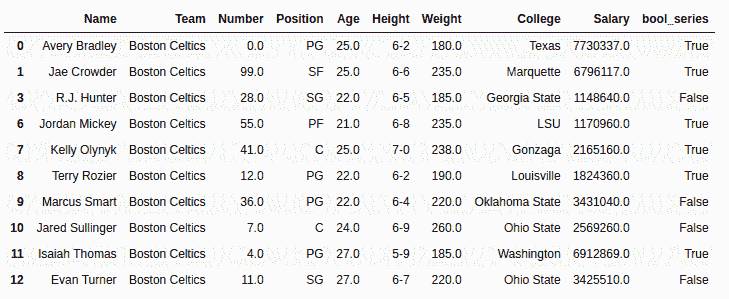
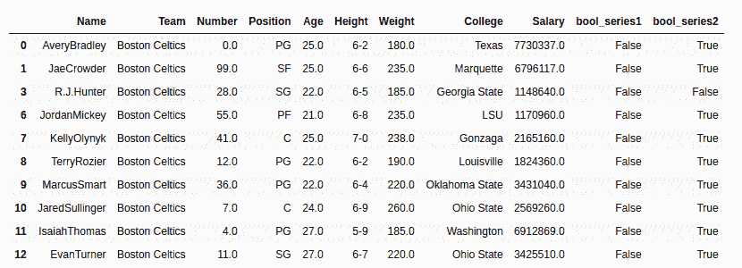

# Python | Pandas series . str . isalpha()

> 原文:[https://www . geesforgeks . org/python-pandas-series-str-isalpha/](https://www.geeksforgeeks.org/python-pandas-series-str-isalpha/)

Python 是进行数据分析的优秀语言，主要是因为以数据为中心的 Python 包的奇妙生态系统。 ***【熊猫】*** 就是其中一个包，让导入和分析数据变得容易多了。

Pandas `**str.isalpha()**`方法用于检查序列中每个字符串中的所有字符是否都是字母(a-z/A-Z)。字符串中出现的空白或任何其他字符都将返回 false，但是如果有完整的数值，它将返回 NaN。

> **语法:** Series.str.isalpha()
> 
> **返回类型:**布尔序列，根据调用方序列，也可能包含空值。

要下载代码中使用的 CSV，点击这里的[。](https://media.geeksforgeeks.org/wp-content/uploads/nba.csv)

在下面的例子中，使用的数据框包含了一些 NBA 球员的数据。任何操作前的数据框图像附在下面。


**示例#1:**
在此示例中，isalpha()方法应用于 College 列。在此之前，使用移除空行。方法来避免错误。

```
# importing pandas module
import pandas as pd

# making data frame
data = pd.read_csv("https://media.geeksforgeeks.org/wp-content/uploads/nba.csv")

# removing null values to avoid errors
data.dropna(inplace = True)

# creating bool series
data["bool_series"]= data["College"].str.isalpha()

# display
data
```

**输出:**
如输出图像所示，bool_series 可以与 College 列匹配，可以清楚地看到，如果字符串只包含字母，则返回 True。


**示例#2:**
在此示例中，isalpha()方法在 Name 列上应用了两次。首先为原始名称列创建一个 bool 系列，然后使用 [str.replace()](https://www.geeksforgeeks.org/python-pandas-series-str-replace-to-replace-text-in-a-series/) 方法删除空格，然后再次创建一个新的 bool_series。

```
# importing pandas module
import pandas as pd

# making data frame
data = pd.read_csv("https://media.geeksforgeeks.org/wp-content/uploads/nba.csv")

# removing null values to avoid errors
data.dropna(inplace = True)

# creating bool series with original column
data["bool_series1"]= data["Name"].str.isalpha()

# removing white spaces
data["Name"]= data["Name"].str.replace(" ", "")

# creating bool series with new column
data["bool_series2"]= data["Name"].str.isalpha()

# display
data.head(10)
```

**输出:**
如输出图像所示，Bool 序列对所有值都是假的，直到字符串有空白。删除空格后，bool 序列仅在字符串包含特殊字符的情况下为 false。
