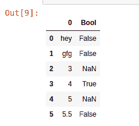
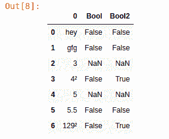

# Python | Pandas series . str . is descimal()

> 原文:[https://www . geesforgeks . org/python-pandas-series-str-isdecimal/](https://www.geeksforgeeks.org/python-pandas-series-str-isdecimal/)

Python 是进行数据分析的优秀语言，主要是因为以数据为中心的 Python 包的奇妙生态系统。 ***【熊猫】*** 就是其中一个包，让导入和分析数据变得容易多了。

熊猫 **`isdecimal()`** 用于检查字符串中的所有字符是否都是小数。此方法的工作方式与 str.isdigit()方法相似，但不同之处在于后者相对于非 ASCII 数字更具扩展性。这将通过一个例子来说明。

> **语法:**series . str . is descimal()
> T3】返回类型:布尔系列

**示例#1:**
在此示例中，创建了一个只有一列的新数据框，并向其传递了一些值。然后在该列上调用 str.isdecimal()方法，并将输出返回到新的 Bool 列。

```py
# importing pandas module 
import pandas as pd

# creating data frame
data = pd.DataFrame(["hey", "gfg", 3, "4", 5, "5.5"])

# calling method and returning series
data["Bool"]= data[0].str.isdecimal()

# display
data
```

**输出:**
如输出图像所示，对于字符串形式的十进制值，小数返回 True。如果元素是 int、float 或除字符串之外的任何其他数据类型，则返回 NaN(无论它是否是十进制数)


**例 2:**
在本例中，带幂的数字也加到了那一列。str isdigit()和 str.isdecimal()都被调用，输出存储在不同的列中，以比较两者之间的差异。

```py
# importing pandas module 
import pandas as pd

# creating data frame
data = pd.DataFrame(["hey", "gfg", 3, "4²", 5, "5.5", "129²"])

# calling method and returning series
data["Bool"]= data[0].str.isdecimal()

# calling method and returning series
data["Bool2"]= data[0].str.isdigit()

# display
data
```

**输出:**
如输出图像所示，对于有幂的数字，isdigit()返回 True，但是对于那些值，isdecimal()返回 False。
