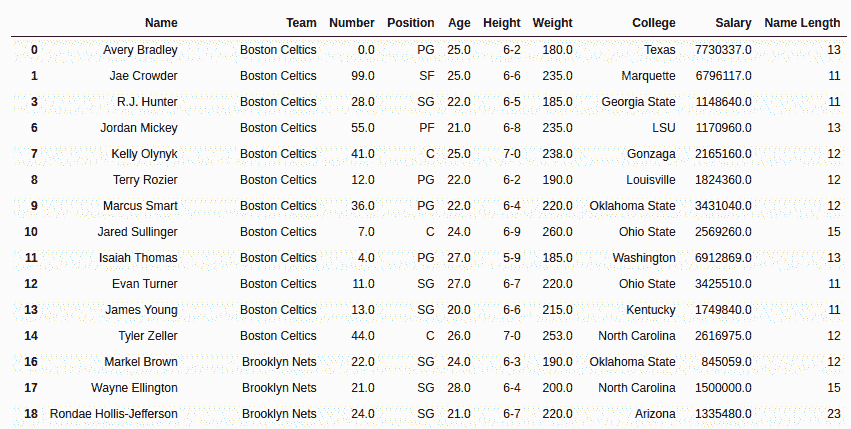
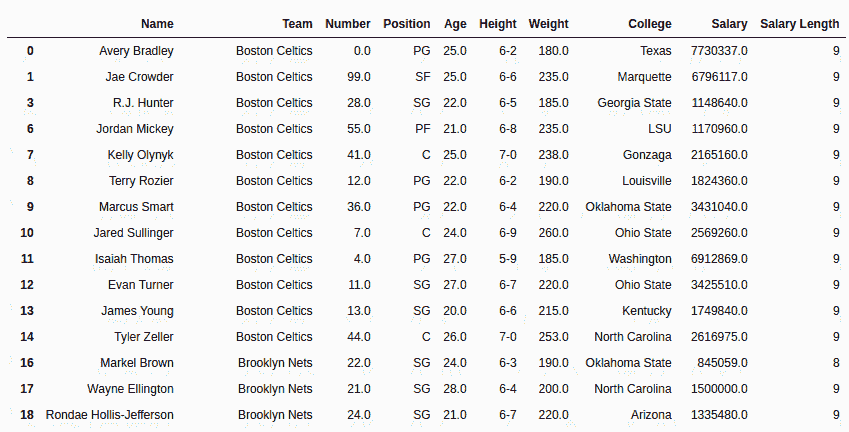

# Python | Pandas series . str . len()

> 原文:[https://www.geeksforgeeks.org/python-pandas-series-str-len/](https://www.geeksforgeeks.org/python-pandas-series-str-len/)

Python 是进行数据分析的优秀语言，主要是因为以数据为中心的 Python 包的奇妙生态系统。 ***【熊猫】*** 就是其中一个包，让导入和分析数据变得容易多了。

熊猫 **`str.len()`** 方法用于确定熊猫系列中每根绳子的长度。此方法仅适用于一系列字符串。
既然是弦法， ***。str*** 在每次调用这个方法之前都必须加上前缀。否则会给出一个错误。

> **语法:** Series.str.len()
> 
> **返回类型:**整数值系列。根据调用者系列，也可能存在空值。

要下载代码中使用的 CSV，点击这里的[。](https://media.geeksforgeeks.org/wp-content/uploads/nba.csv)

在下面的例子中，使用的数据框包含了一些 NBA 球员的数据。任何操作前的数据框图像附在下面。


**示例#1:** 计算字符串序列的长度(dtype=str)

在本例中，“名称”列的字符串长度是使用 str.len()方法计算的。系列的数据类型已经是字符串。所以不需要数据类型转换。在执行任何操作之前，会删除空行以避免错误。

```py
# importing pandas module 
import pandas as pd

# reading csv file from url 
data = pd.read_csv("https://media.geeksforgeeks.org/wp-content/uploads/nba.csv")

# dropping null value columns to avoid errors
data.dropna(inplace = True)

# creating new column for len
# passing values through str.len()
data["Name Length"]= data["Name"].str.len()

# display
data
```

**输出:**
如输出图像所示，返回名称列中每个字符串的长度。


**注:**

*   This method doesn’t count length of integer or float series. It will give an error since it’s not a string series. The series need to be converted first ( Shown in next Example)
*   没有处理空值的参数。空值也会在输出字符串中返回空值。

**例#2:**
在本例中，使用 str.len()方法计算薪资列的长度。由于该系列是作为 float64 数据类型导入的，因此首先使用。astype()方法。

```py
# importing pandas module 
import pandas as pd

# reading csv file from url 
data = pd.read_csv("https://media.geeksforgeeks.org/wp-content/uploads/nba.csv")

# dropping null value columns to avoid errors
data.dropna(inplace = True)

# converting to string dtype
data["Salary"]= data["Salary"].astype(str)

# passing values
data["Salary Length"]= data["Salary"].str.len()

# converting back to float dtype
data["Salary"]= data["Salary"].astype(float)

# display
data
```

**输出:**
如输出所示，int 或 float 系列的长度只能通过将其转换为 string dtype 来计算。
