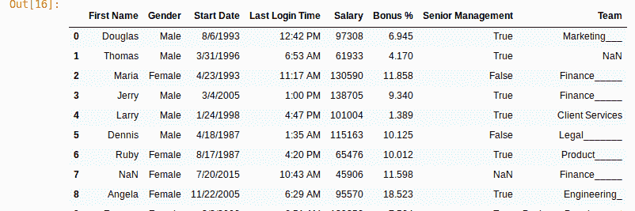
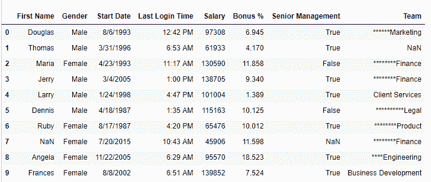

# Python | Pandas series . str . ljust()和 rjust()

> 原文:[https://www . geesforgeks . org/python-pandas-series-str-ljust-and-rjust/](https://www.geeksforgeeks.org/python-pandas-series-str-ljust-and-rjust/)

Python 是进行数据分析的优秀语言，主要是因为以数据为中心的 Python 包的奇妙生态系统。 ***【熊猫】*** 就是其中一个包，让导入和分析数据变得容易多了。

熊猫**`.ljust()`****`.rjust()`** 是*系列*中用来处理文字数据的文字方法。由于这些方法仅适用于字符串， ***。str*** 每次调用这个方法之前都要加前缀。
这些方法将字符或字符串作为输入参数，并根据使用的功能将其作为序列中字符串的前缀或后缀。(如果使用 ljust()则为后缀，如果使用 rjust()则为前缀)。

> **语法:**T2【series . str . ljust(width，fillchar= ' ')
> series . str . rjust(width，fill char = ' ')
> 
> **参数:**
> **宽度:**输出字符串的最小宽度，如果宽度小于字符串长度，则不连接任何内容
> **fillchar:** 字符串值，用传递的字符串填充(长度–宽度)字符。
> 
> **返回类型:**串联字符串系列

**注意:** *fillchar* 只取一个字符，传递多个字符的字符串会返回错误。

要下载以下示例中使用的数据集，请单击此处的[。](https://media.geeksforgeeks.org/wp-content/uploads/employees.csv)

在以下示例中，使用的数据框包含一些员工的数据。任何操作前的数据框图像附在下面。


**示例# 1:**series . str . ljust()的使用

在本例中，为团队列设置了 12 的最大宽度，并将“_”作为 fillchar 传递，用下划线填充剩余的空间。如果字符串长度小于宽度，则“_”将以字符串作为后缀。

```
# importing pandas module
import pandas as pd

# importing csv from link
# making data frame from csv
data = pd.read_csv("https://media.geeksforgeeks.org/wp-content/uploads/employees.csv")

# width of output string
width = 12

# character to put 
char ="_"

# calling function and overwriting df
data["Team"]= data["Team"].str.ljust(width, char)

# display
data.head(10)
```

**输出:**
如输出图像所示，团队字符串现在在旧字符串后面加了“_”。


**例 2:** 使用 Series.str.rjust()

在本例中，为团队列设置了 15 的最大宽度，并将“*”作为 fillchar 传递，以“*”填充剩余的空间。如果字符串长度小于宽度，则“*”将以字符串作为前缀。

```
# importing pandas module
import pandas as pd

# importing csv from link
# making data frame from csv
data = pd.read_csv("https://media.geeksforgeeks.org/wp-content/uploads/employees.csv")

# width of output string
width = 15

# character to put 
char ="*"

# calling function and overwriting df
data["Team"]= data["Team"].str.rjust(width, char)

# display
data.head(10)
```

**输出:**
如输出图像所示，团队字符串现在在旧字符串前有“*”前缀。

