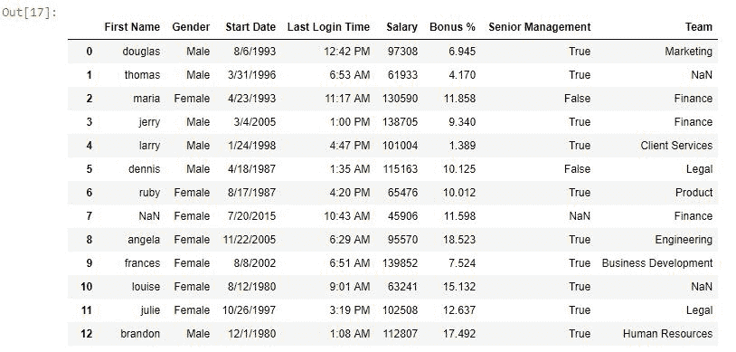
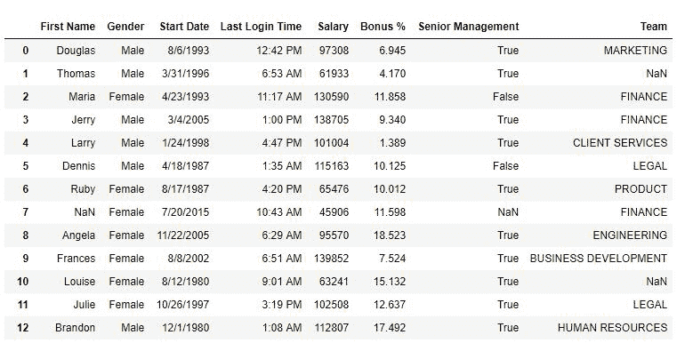

# Python | Pandas series . str . lower()，upper()和 title()

> 原文:[https://www . geesforgeks . org/python-pandas-series-str-lower-upper-and-title/](https://www.geeksforgeeks.org/python-pandas-series-str-lower-upper-and-title/)

Python 是进行数据分析的优秀语言，主要是因为以数据为中心的 Python 包的奇妙生态系统。 ***【熊猫】*** 就是其中一个包，让导入和分析数据变得容易多了。

Python 有一些将字符串转换成小写、大写或 Camel 大小写的内置方法。但是这些方法不适用于列表和其他多字符串对象。Pandas 是一个用于数据分析的库，它提供了将系列中的所有值转换为相应文本案例的独立方法。既然，下、上、标题也是 Python 关键词， ***。在熊猫系列上调用这些函数之前，必须给它们加上前缀。
**语法:*****

```
Series.str.lower()
Series.str.upper()
Series.str.title()
```

**参数:**不取任何参数

**返回类型:**新值系列

要下载使用的 CSV 文件，点击这里[。](https://media.geeksforgeeks.org/wp-content/uploads/employees.csv)

在以下示例中，使用的数据框包含一些员工的数据。任何操作前的数据框图像附在下面。


**示例#1:** 在一个系列中使用 **`.lower()`**

在这个例子中。名字列正在调用 lower()函数，因此名字列中的所有值都将转换为小写。

```
# importing pandas package
import pandas as pd

# making data frame from csv file
data = pd.read_csv("employees.csv")

# converting and overwriting values in column
data["First Name"]= data["First Name"].str.lower()

# display
data
```

**输出:**
如数据框的输出图像所示，名字列中的所有值都已转换为小写。


**示例 2:** 在系列中使用 **`.upper()`**

在这个例子中。“团队”列正在调用 upper()函数，因此“团队”列中的所有值都将转换为大写。

```
# importing pandas package
import pandas as pd

# making data frame from csv file
data = pd.read_csv("employees.csv")

# converting and overwriting values in column
data["Team"]= data["Team"].str.upper()

# display
data
```

**输出:**
如数据帧的输出图像所示，Team 列中的所有值都已转换为大写。


**示例#3:** 在系列中使用 **`.title()`**

在这个例子中。“团队”列正在调用 title()函数，因此“进入”列中的所有值都将转换为 Camel 格式。由于“团队”列中的值已经是 camel 大小写，因此它之前已经转换为大写，然后再次转换为 camel 大小写，以便验证的功能。title()方法。

```
# importing pandas package
import pandas as pd

# making data frame from csv file
data = pd.read_csv("employees.csv")

# converting and overwriting values in column
data["Team"]= data["Team"].str.upper().str.title()

# display
data
```

**输出:**
如数据帧的输出图像所示，Team 列中的所有值都已转换为 Camel case。
