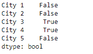
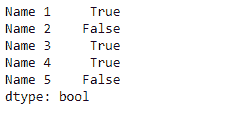

# Python | Pandas series . str . match()

> 原文:[https://www . geesforgeks . org/python-pandas-series-str-match/](https://www.geeksforgeeks.org/python-pandas-series-str-match/)

`Series.str`可用于以字符串形式访问系列的值，并对其应用多种方法。Pandas `**Series.str.match()**`函数用于确定给定序列对象的基础数据中的每个字符串是否匹配正则表达式。

> **语法:** Series.str.match(pat，case=True，flags=0，na=nan)
> 
> **参数:**
> **拍:**带捕捉组的正则表达式模式。
> **大小写:**如果为真，区分大小写
> **标志:**一个 re 模块标志，例如 re . ignorecase .
> **na:**默认 NaN，为缺失值填充值
> 
> **返回:**布尔值系列/数组

**示例#1:** 使用`Series.str.match()`函数将传递的正则表达式与给定序列对象的基础数据中的字符串进行匹配。

```py
# importing pandas as pd
import pandas as pd

# importing re for regular expressions
import re

# Creating the Series
sr = pd.Series(['New_York', 'Lisbon', 'Tokyo', 'Paris', 'Munich'])

# Creating the index
idx = ['City 1', 'City 2', 'City 3', 'City 4', 'City 5']

# set the index
sr.index = idx

# Print the series
print(sr)
```

**输出:**


现在我们将使用`Series.str.match()`函数将传递的正则表达式与给定序列对象的基础数据中的字符串进行匹配。

```py
# match either 'Tokyo' or 'Paris'
result = sr.str.match(pat = '(Tokyo)|(Paris)')

# print the result
print(result)
```

**输出:**



正如我们在输出中看到的那样，`Series.str.match()`函数已经返回了一系列布尔值。对于那些成功匹配的值，它包含`True`，否则它包含`False`。

**示例#2 :** 使用`Series.str.match()`函数将传递的正则表达式与给定序列对象的基础数据中的字符串进行匹配。

```py
# importing pandas as pd
import pandas as pd

# importing re for regular expressions
import re

# Creating the Series
sr = pd.Series(['Mike', 'Alessa', 'Nick', 'Kim', 'Britney'])

# Creating the index
idx = ['Name 1', 'Name 2', 'Name 3', 'Name 4', 'Name 5']

# set the index
sr.index = idx

# Print the series
print(sr)
```

**输出:**


现在我们将使用`Series.str.match()`函数将传递的正则表达式与给定序列对象的基础数据中的字符串进行匹配。

```py
# match groups having any capital letter
# followed by 'i' and any other character
result = sr.str.match(pat = '([A-Z]i.)')

# print the result
print(result)
```

**输出:**



正如我们在输出中看到的那样，`Series.str.match()`函数已经返回了一系列布尔值。对于那些成功匹配的值，它包含`True`，否则它包含`False`。