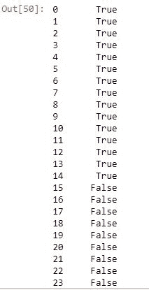
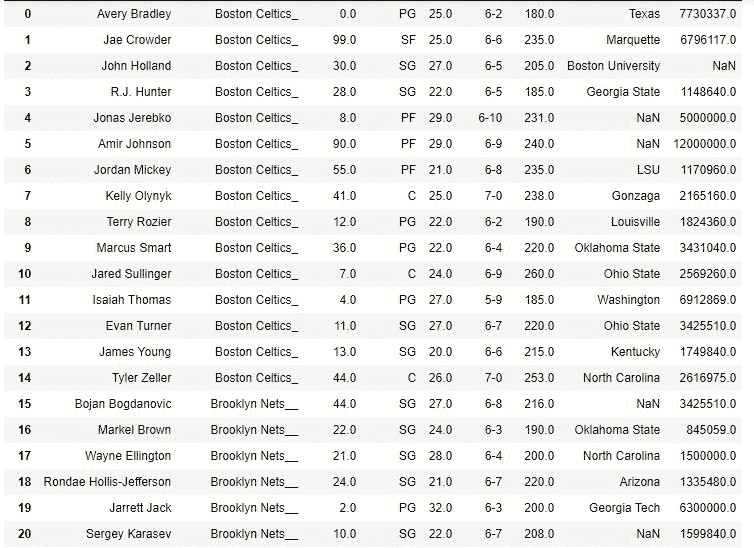
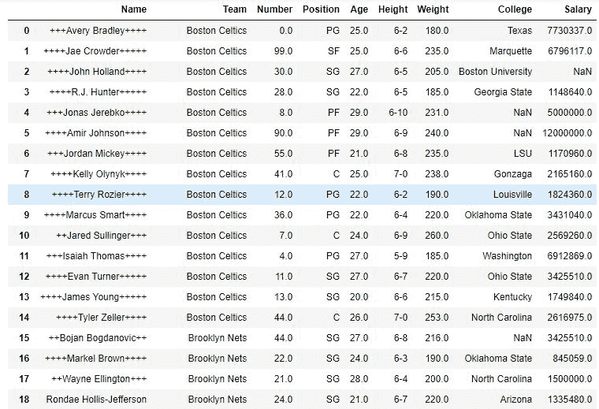

# Python | Pandas series . str . pad()

> 原文:[https://www.geeksforgeeks.org/python-pandas-series-str-pad/](https://www.geeksforgeeks.org/python-pandas-series-str-pad/)

Python 是进行数据分析的优秀语言，主要是因为以数据为中心的 python 包的奇妙生态系统。 ***【熊猫】*** 就是其中一个包，让导入和分析数据变得容易多了。

熊猫提供了一种方法来为序列中的每个字符串元素添加填充(空格或其他字符)。 ***。str*** 每次调用这个方法之前都要加上前缀，以区别于 Python 的默认函数，否则会抛出错误。

> **语法:** Series.str.pad(宽度，边= '左'，fillchar= ' ')
> 
> **参数:**
> **宽度**:结果字符串的最小宽度。
> 
> *   如果宽度小于或等于字符串长度，则不添加填充。*   If width is more than the string length, the extra space is filled with whitespaces or passed character.
>     
>     **侧**:字符串输入(‘左’、‘右’或‘两者’)。默认值为“左”。填充将在各自的侧面平均添加。
>     **填充符:**要填充的字符。默认值为' '(空白)。
>     
>     
>     
>     **返回类型:**在字符串的传递端添加空格/字符的序列

要下载代码中使用的 CSV，点击这里的[。](https://media.geeksforgeeks.org/wp-content/uploads/nba.csv)

在下面的例子中，使用的数据框包含了一些 NBA 球员的数据。 **`str.pad()`** 方法将用于给文本添加填充。任何操作前的数据帧图像如下所示:


**示例#1:** 左填充

在本例中，字符串的最小长度设置为 15，并使用 **`str.pad()`** 方法在团队列中的字符串左侧添加空格。由于看不到空格，因此将它们与自定义输入字符串进行比较，并检查结果是否为真，仅针对球队名称“波士顿凯尔特人队”。

```py
# importing pandas module
import pandas as pd

# making data frame from csv at url
data = pd.read_csv("https://media.geeksforgeeks.org/wp-content/upload/nba.csv")

# removing null values to avoid errors
data.dropna(how ='all', inplace = True)

# adding white spaces to left side
data["Team"]= data["Team"].str.pad(15, side ='left')

# custom string
string =' Boston Celtics'

# checking if same or not
data["Team"]== string
```

**输出:**
如输出图像所示，球队名称波士顿凯尔特人的条件为 True，这意味着空格添加成功。同样，其他字符串也会根据它们的长度进行填充。


**示例#2:** 右侧填充

在本例中，字符串的最小长度设置为 15，并使用 str.pad()方法将“_”添加到“团队”列中字符串的右侧。“_”被传递给 fillchar 参数以添加它，而不是默认的空格。

```py
# importing pandas module
import pandas as pd

# making data frame
data = pd.read_csv("https://media.geeksforgeeks.org/wp-content/uploads/nba.csv")

# removing null values to avoid errors
data.dropna(how ='all', inplace = True)

# adding white spaces to left side
data["Team"]= data["Team"].str.pad(15, side ='right', fillchar ='_')

# output display
data
```

**输出:**
如输出图像所示，根据字符串的长度，字符串右侧添加了“_”。填充后，每个字符串的长度为 15。


**例 3:** 两侧填充

在本例中，使用 str.pad()中的 fillchar 参数将“+”添加到字符串的两端。width 参数设置为 20，这样填充后每个字符串的长度都变得相同。

```py
# importing pandas module
import pandas as pd

# making data frame
data = pd.read_csv("https://media.geeksforgeeks.org/wp-content/uploads/nba.csv")

# removing null values to avoid errors
data.dropna(how ='all', inplace = True)

# adding white spaces to left side
data["Name"]= data["Name"].str.pad(20, side ='both', fillchar ='+')

# output
data
```

**输出:**
如输出图像所示，字符串的两侧添加了“+”。每个字符串中“+”号的数量可能不同，但填充后每个字符串的长度为 20。

**注意:**从图中可以看出，如果字符串左边有奇数个位置(宽–长)，那么优先考虑右边。因此，左边的一个字符将被添加到右边。

与名称列的第一行一样，字符串长度为 13。所以 20-13 = 7。因此，左侧增加了 3 个“+”，右侧增加了 4 个。
