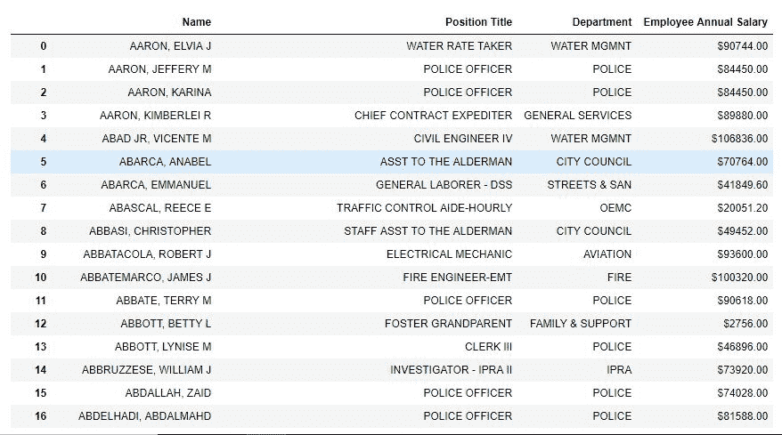
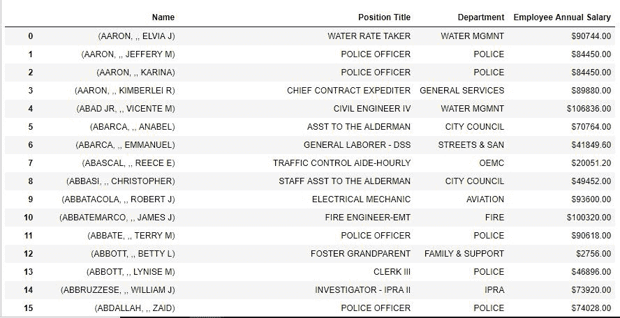
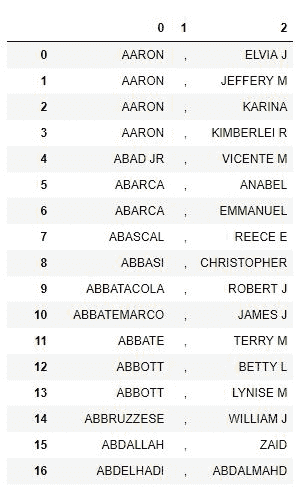
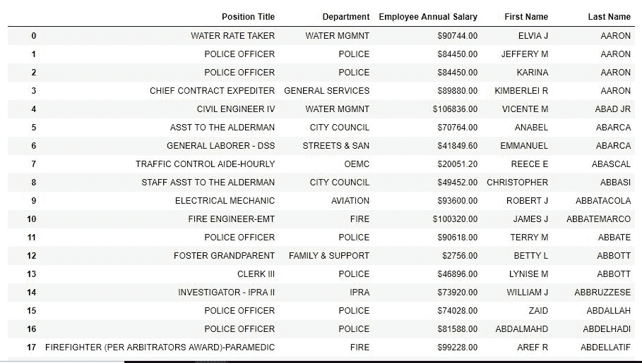

# Python | Pandas series . str . partition()

> 原文:[https://www . geesforgeks . org/python-pandas-series-str-partition/](https://www.geeksforgeeks.org/python-pandas-series-str-partition/)

Python 是进行数据分析的优秀语言，主要是因为以数据为中心的 Python 包的奇妙生态系统。 ***【熊猫】*** 就是其中一个包，让导入和分析数据变得容易多了。

熊猫 **`str.partition()`** 的工作方式与`[str.split()](https://www.geeksforgeeks.org/python-string-split/)`相似。它不是在分隔符/分隔符每次出现时拆分字符串，而是仅在第一次出现时拆分字符串**。**在拆分功能中，分隔符不存储在任何地方，只有其周围的文本存储在新的列表/数据框中。但是在 **`str.partition()`** 方法中，分隔符也是存储的。

***。str*** 在每次调用这个方法之前都必须加上前缀，以区别于 Python 的默认函数，否则会抛出一个错误。

> **语法:** Series.str.partition(pat= ' '，expand=True)
> 
> **参数:**
> 
> **pat:** 字符串值、分隔符或分隔字符串的分隔符。默认值为' '(空白)
> **展开:**布尔值，如果为真，则返回不同列中具有不同值的数据框。否则它会返回一个包含字符串列表的序列。默认值为真。
> 
> **返回类型:**一系列列表或数据框，具体取决于展开参数

要下载代码中使用的 CSV，点击这里的[。](https://media.geeksforgeeks.org/wp-content/uploads/chicago.csv)

在以下示例中，使用的数据框包含一些员工的数据。任何操作前的数据框图像附在下面。


**示例#1:** 将字符串拆分为列表

在本例中，“名称”列在第一次出现“，”时被拆分。扩展参数保持为假，以便将其扩展到列表中，而不是数据框中。

```
# importing pandas module
import pandas as pd

# making data frame
data = pd.read_csv("https://media.geeksforgeeks.org/wp-content/uploads/chicago.csv")

# removing null values if any to avoid errors
data.dropna(how ='all', inplace = True)

# displaying top 5 rows of data
data.head()

# splitting at ', ' into list
data["Name"]= data["Name"].str.partition(", ", False)

# display
data
```

**输出:**
如输出图像所示，名称列在第一次出现“，”时被拆分为列表。可以看出，'，'也是作为一个单独的列表元素存储的。

**注意:**不要被列表中的两个逗号混淆，一个是元素，一个是元素分隔符。



**示例#2:** 将字符串拆分为数据框

在本例中，名和姓与“名称”列分开，并存储在数据框的单独列中。

```
# importing pandas module
import pandas as pd

# making data frame
data = pd.read_csv("https://media.geeksforgeeks.org/wp-content/uploads/chicago.csv")

# removing null values if any to avoid errors
data.dropna(how ='all', inplace = True)

# displaying top 5 rows of data
data.head()

# splitting at ', ' into Data frame
new = data["Name"].str.partition(", ", True)

# making separate first name column from new data frame
data["First Name"]= new[2]

# making separate last name column from new data frame
data["Last Name"]= new[0]

# Dropping old Name columns
data.drop(columns =["Name"], inplace = True)

# df display
data
```

**输出:**
如输出图像所示，“名称”列被分成 3 列的数据框(逗号前的字符串和逗号后的字符串之一)。之后，数据框被用于在同一数据框中创建新列。旧名称列已使用删除。drop()方法。

**新数据框-**


**添加了列的数据框-**
