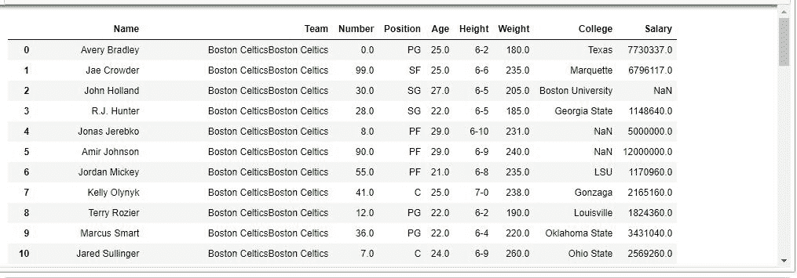
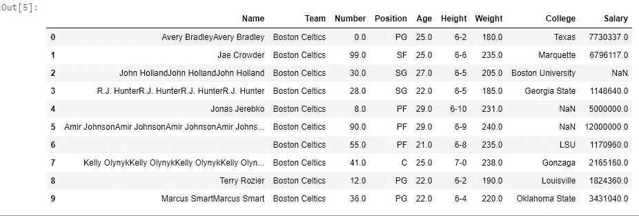

# Python | Pandas series . str . repeat()

> 原文:[https://www . geesforgeks . org/python-pandas-series-str-repeat/](https://www.geeksforgeeks.org/python-pandas-series-str-repeat/)

Python 是进行数据分析的优秀语言，主要是因为以数据为中心的 Python 包的奇妙生态系统。 ***【熊猫】*** 就是其中一个包，让导入和分析数据变得容易多了。
Pandas **str.repeat()** 方法用于在传递序列本身的相同位置重复字符串值。还可以传递一个数组来定义每个元素应该连续重复的次数。在这种情况下，数组的长度必须与系列的长度相同。
***。str*** 每次调用这个函数之前都必须加上前缀，因为它是一个字符串方法，也是为了区别于 python 默认的 repeat 方法。

> **语法:**series . str . repeat(repeats)
> **参数:**
> **repeats:** int 或 int 列表定义字符串必须重复的次数。(列表大小必须等于系列)
> **返回类型:**重复值系列

要下载代码中使用的 CSV，点击这里的[。](https://media.geeksforgeeks.org/wp-content/uploads/nba.csv)
在下面的例子中，使用的数据框包含了一些 NBA 球员的数据。任何操作前的数据框图像附在下面。


**示例#1:** 重复相同次数
在此示例中，单个整数作为 repeats 参数传递，因此序列中的每个字符串值将重复相同次数。在应用任何操作之前，必须删除空值以避免错误。因此 dropna()方法用于移除空值。

## 蟒蛇 3

```
# importing pandas module
import pandas as pd

# making data frame
data = pd.read_csv("https://media.geeksforgeeks.org/wp-content/uploads/nba.csv")

# removing null values to avoid errors
data.dropna(how ='all', inplace = True)

# overwriting with repeated value
data["Team"]= data["Team"].str.repeat(2)

# display
data
```

**输出:**
如输出图像所示，序列中的每个字符串重复两次。



**示例#2:** 每个字符串的不同值
在此示例中，使用创建了一个 10 行的示例数据框。head()方法。之后，创建一个包含 10 个整数的列表，并将其传递给 repeat()函数，以将每个字符串重复不同的次数。

## 蟒蛇 3

```
# importing pandas module
import pandas as pd

# making data frame
data = pd.read_csv("https://media.geeksforgeeks.org/wp-content/uploads/nba.csv")

# removing null values to avoid errors
data.dropna(how ='all', inplace = True)

# creating data of 10 rows
sample_data = data.head(10).copy()

# creating list of 10 int
repeat_list =[2, 1, 3, 4, 1, 5, 0, 6, 1, 2]

# calling repeat function
sample_data["Name"]= sample_data["Name"].str.repeat(repeat_list)

# displaying data
sample_data
```

**输出:**
如输出图像所示，根据 repeat_list 中同一索引处出现的整数重复该字符串。
**注意:**列表中的一个值被设置为 0，因此该字符串在最终系列中被重复 0 次(旧的字符串值也被删除并存储为空白)

