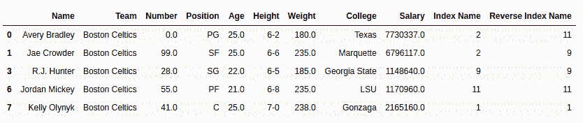
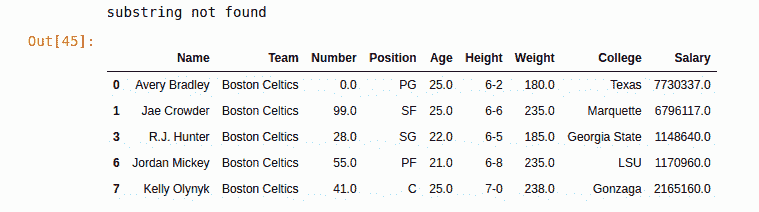

# Python | Pandas series . str . rindex()

> 原文:[https://www . geesforgeks . org/python-pandas-series-str-rindex/](https://www.geeksforgeeks.org/python-pandas-series-str-rindex/)

Python 是进行数据分析的优秀语言，主要是因为以数据为中心的 Python 包的奇妙生态系统。 ***【熊猫】*** 就是其中一个包，让导入和分析数据变得容易多了。

Pandas `**str.rindex()**`方法用于搜索并返回序列中每个字符串的特定部分(开始和结束之间)的子字符串的最高索引(从右侧开始)。此方法的工作方式与`[str.find()](https://www.geeksforgeeks.org/python-pandas-seres-str-find/)`类似，但在未找到的情况下，`str.rindex()`不是返回-1，而是给出一个 ValueError。

**注:**该方法不同于 str.index()。str.rindex()用于反向搜索。如果子字符串在字符串中只存在一次，str.index()和 str.rindex()的输出相同。

> **语法:** Series.str.rindex(sub，start=0，end=None)
> 
> **参数:**
> **子:**要在系列文本值中搜索的字符串或字符
> **开始:**要在系列文本值中搜索的字符串或字符
> **结束:**要在系列文本值中搜索的字符串或字符
> 
> **返回类型:**找到子串索引最高的序列。

要下载下例使用的数据集，点击这里的[。](https://media.geeksforgeeks.org/wp-content/uploads/nba.csv)
在下面的例子中，使用的数据框包含了一些 NBA 球员的数据。任何操作前的数据框图像附在下面。


**示例#1:** 当每个字符串中都存在子字符串时，查找最高索引

在本例中，“e”作为子字符串传递。因为“e”存在于所有 5 个字符串中，所以返回它出现的最高索引。应用 index 和 rindex 方法，并将输出存储在不同的列中进行比较。在应用任何操作之前，使用。dropna()方法。

```py
# importing pandas module 
import pandas as pd

# reading csv file from url 
data = pd.read_csv("https://media.geeksforgeeks.org/wp-content/uploads/nba.csv")

# dropping null value columns to avoid errors
data.dropna(inplace = True)

# extracting 5 rows
short_data = data.head().copy()

# calling str.index() method
short_data["Index Name"]= short_data["Name"].str.index("e")

# calling str.rindex() method
short_data["Reverse Index Name"]= short_data["Name"].str.rindex("e")

# display
short_data
```

**输出:**
如输出图所示，可以比较一下。index()方法返回的索引最少，而 str.rindex()方法返回的索引最高。


**示例#2:**
在此示例中，在前 5 行中搜索“a”。由于“a”不存在于每个字符串中，因此将返回值错误。若要处理错误，请尝试使用和 except。

```py
# importing pandas module 
import pandas as pd

# reading csv file from url 
data = pd.read_csv("https://media.geeksforgeeks.org/wp-content/uploads/nba.csv")

# dropping null value columns to avoid errors
data.dropna(inplace = True)

# extracting 5 rows
short_data = data.head().copy()

# calling str.rindex() method
try:
    short_data["Index Name"]= short_data["Name"].str.rindex("a")
except Exception as err:
    print(err)

# display
short_data
```

**输出:**
如输出图像所示，输出数据帧没有索引名称列，并且打印了错误“未找到子字符串”。这是因为 str.rindex()在未找到时返回 ValueError，因此它必须转到 except case 并打印错误。
