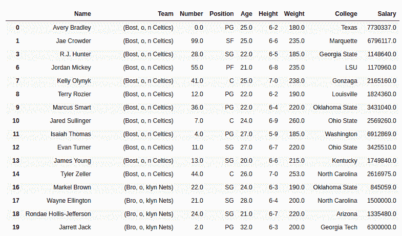
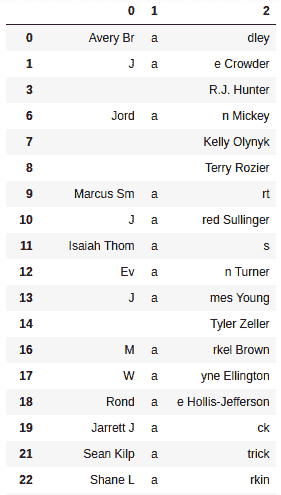

# Python | Pandas series . str . rpartition()

> 原文:[https://www . geesforgeks . org/python-pandas-series-str-rpartition/](https://www.geeksforgeeks.org/python-pandas-series-str-rpartition/)

Python 是进行数据分析的优秀语言，主要是因为以数据为中心的 Python 包的奇妙生态系统。 ***【熊猫】*** 就是其中一个包，让导入和分析数据变得容易多了。
熊猫**str partition()**的工作方式类似于[str partition()](https://www.geeksforgeeks.org/python-pandas-series-str-partition/)和 str.split()。**不是每次出现都从左侧拆分字符串。rpartition()** 只拆分字符串一次，而且拆分的方向也是相反的(从右侧)。不像。split()方法，rpartition()方法也存储分隔符/分隔符。
***。str*** 每次调用这个方法之前都要加上前缀，以区别于 Python 的默认函数，否则会抛出错误。
**注意:**该方法与 str.partition()方法不同，不是在第一次出现时拆分，而是在分隔符/分隔符的最后一次出现时拆分。

> **语法:** Series.str.rpartition(pat= ' '，expand=True)
> **参数:**
> **pat:** 字符串值、分隔符或分隔字符串的分隔符。默认值为' '(空白)
> **expand:** 布尔值，如果为 True，则返回不同列中具有不同值的数据框。否则它会返回一个包含字符串列表的序列。默认值为真。
> **返回类型:**系列列表或数据框，具体取决于展开参数

要下载代码中使用的 CSV，点击这里的[。](https://media.geeksforgeeks.org/wp-content/uploads/nba.csv)
在下面的例子中，使用的数据框包含了一些 NBA 球员的数据。任何操作前的数据框图像附在下面。


**示例#1:** 将字符串拆分为列表
在本例中，团队列在最后一次出现“o”时被拆分为列表。在执行任何操作之前，使用。方法来避免错误。

## 蟒蛇 3

```py
# importing pandas module
import pandas as pd

# making data frame
data = pd.read_csv("https://media.geeksforgeeks.org/wp-content/uploads/nba.csv")

# removing null values to avoid errors
data.dropna(inplace = True)

# splitting and overwriting column
data["Team"]= data["Team"].str.rpartition("o", False)

# display
data
```

**输出:**
如输出图像所示，字符串“波士顿凯尔特人”在最后一次出现“o”时被分开。返回的列表也有分隔符。



**示例 2:** 将字符串拆分为数据框
在本例中，通过保持展开参数为真，名称列在“a”的最后一次出现时(从右侧第一次出现)被拆分为数据框。在执行任何操作之前，使用。方法来避免错误。

## 蟒蛇 3

```py
# importing pandas module
import pandas as pd

# making data frame
data = pd.read_csv("https://media.geeksforgeeks.org/wp-content/uploads/nba.csv")

# removing null values to avoid errors
data.dropna(inplace = True)

# splitting and overwriting column
df = data["Name"].str.rpartition("a", True)

# display
df
```

**输出:**
如输出图像所示，字符串在最后一次出现“a”时被拆分成数据框。



**注意:**如果字符串中没有出现分隔符，则整个字符串存储在数据框的最后一列/列表的最后一个索引中。