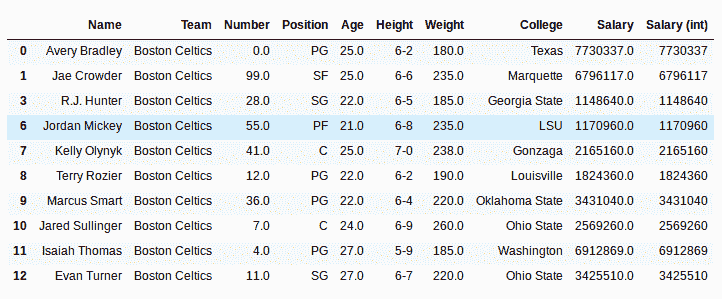
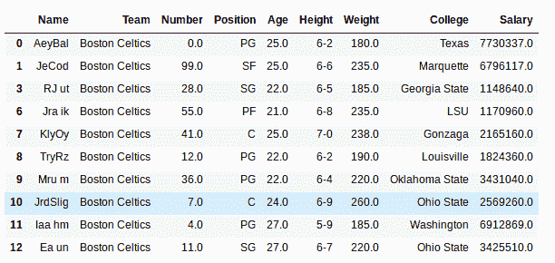

# Python | Pandas series . str . slice()

> 原文:[https://www . geesforgeks . org/python-pandas-series-str-slice/](https://www.geeksforgeeks.org/python-pandas-series-str-slice/)

Python 是进行数据分析的优秀语言，主要是因为以数据为中心的 python 包的奇妙生态系统。Pandas 就是其中之一，它让数据的导入和分析变得更加容易。

熊猫 **`str.slice()`** 方法用于从熊猫系列对象中的字符串中分割子字符串。它非常类似于 Python 对对象进行切片的基本原理，在[start:stop:step]上工作，这意味着它需要三个参数，从哪里开始、从哪里结束以及跳过多少元素。
既然这是熊猫串法， ***。str*** 每次调用这个方法之前都要加上前缀。否则，它会给出错误。

> **语法:** Series.str.slice(开始=无，停止=无，步骤=无)
> 
> **参数:**
> **start:** int 值，告诉从哪里开始切片
> **stop:** int 值，告诉从哪里结束切片
> **step:** int 值，告诉切片过程中要步进多少字符
> 
> **返回类型:**带有切片子字符串的序列

要下载代码中使用的 CSV，点击这里的[。](https://media.geeksforgeeks.org/wp-content/uploads/nba.csv)

在下面的例子中，使用的数据框包含了一些 NBA 球员的数据。任何操作前的数据框图像附在下面。


**示例#1:**
在此示例中，薪资列已被切片以获取小数点前的值。例如，我们想做一些数学运算，为此我们需要整数数据，所以工资列将被切片，直到第二个最后一个元素(-2 位置)。
由于薪资列是作为 float64 数据类型导入的，因此首先使用。astype()方法。

```
# importing pandas module 
import pandas as pd 

# making data frame 
data = pd.read_csv("https://media.geeksforgeeks.org/wp-content/uploads/nba.csv") 

# removing null values to avoid errors 
data.dropna(inplace = True) 

# start stop and step variables
start, stop, step = 0, -2, 1

# converting to string data type
data["Salary"]= data["Salary"].astype(str)

# slicing till 2nd last element
data["Salary (int)"]= data["Salary"].str.slice(start, stop, step)

# display
data.head(10)
```

**输出:**
如输出图像所示，字符串已被切片，小数点前的字符串存储在新列中。


**注意:**这个方法没有任何参数来处理空值，因此它们已经被使用移除了。dropna()方法。

**示例#2:**
在本例中，名称列被切片，步长参数保留为 2。因此，它将在切片过程中步进两个字符。

```
# importing pandas module 
import pandas as pd 

# making data frame 
data = pd.read_csv("https://media.geeksforgeeks.org/wp-content/uploads/nba.csv") 

# removing null values to avoid errors 
data.dropna(inplace = True) 

# start stop and step variables
start, stop, step = 0, -2, 2

# slicing till 2nd last element
data["Name"]= data["Name"].str.slice(start, stop, step)

# display
data.head(10)
```

**输出:**
从输出图像中可以看到，名称被切片，切片过程中跳过了 2 个字符。
