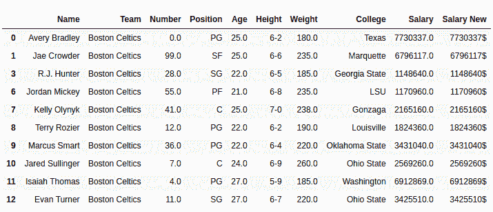

# Python | Pandas series . str . slice _ replace()

> 原文:[https://www . geesforgeks . org/python-pandas-series-str-slice _ replace/](https://www.geeksforgeeks.org/python-pandas-series-str-slice_replace/)

Python 是进行数据分析的优秀语言，主要是因为以数据为中心的 Python 包的奇妙生态系统。 ***【熊猫】*** 就是其中一个包，让导入和分析数据变得容易多了。

熊猫 **`str.slice_replace()`** 方法用于替换熊猫系列对象中存在的切片串。既然这是熊猫串法， ***。str*** 每次调用这个方法之前都要加上前缀。否则，它会给出错误。

> **语法:**series . str . slice _ replace(start =无，stop =无，repl =无)
> 
> **参数:**
> **start:** int 值，告诉从哪里开始切片
> **stop:** int 值，告诉从哪里结束切片
> **repl:** 字符串值，用这个替换切片后的子字符串
> 
> **返回类型:**带替换值的序列

要下载代码中使用的 CSV，点击这里的[。](https://media.geeksforgeeks.org/wp-content/uploads/nba.csv)

在下面的例子中，使用的数据框包含了一些 NBA 球员的数据。任何操作前的数据框图像附在下面。


**示例:**
在本例中，薪资列已被切片，以获得小数点后的值，这些值(' . 0 '被替换为' { content } ' 2019；标志)。由于薪资列是作为 float64 数据类型导入的，因此首先使用。astype()方法。

```py
# importing pandas module 
import pandas as pd 

# making data frame 
data = pd.read_csv("https://media.geeksforgeeks.org/wp-content/uploads/nba.csv") 

# removing null values to avoid errors 
data.dropna(inplace = True) 

# start stop and step variables
start, repl = -2, '{content}apos;

# converting to string data type
data["Salary"]= data["Salary"].astype(str)

# slicing till 2nd last element
data["Salary New"]= data["Salary"].str.slice_replace(start = start, repl = repl)

# display
data.head(10)
```

**输出:**
如输出图像所示，薪资新列已经替换了值。“. 0”已被“{content}”替换。使用。slice_replace()方法。
