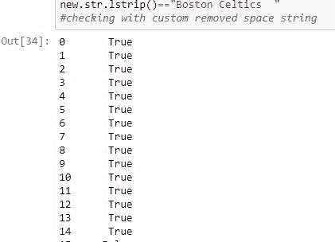
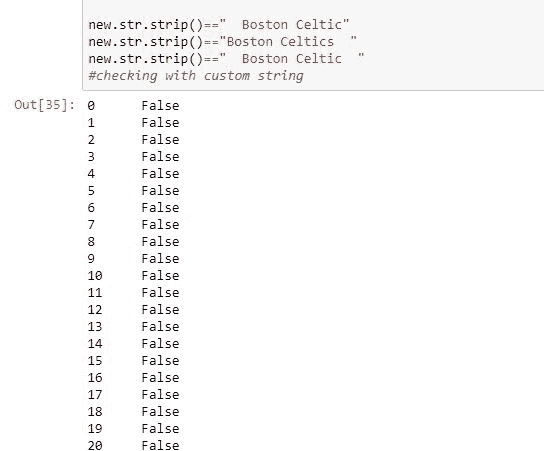

# Python | Pandas series . str . strip()、lstrip()和 rstrip()

> 原文:[https://www . geesforgeks . org/python-pandas-series-str-strip-lstrip-and-rstrip/](https://www.geeksforgeeks.org/python-pandas-series-str-strip-lstrip-and-rstrip/)

Python 是进行数据分析的优秀语言，主要是因为以数据为中心的 Python 包的奇妙生态系统。 ***【熊猫】*** 就是那种让导入和分析数据变得容易得多的包之一。

***熊猫*** 提供了 3 种方法来处理任何文本数据中的空格(包括新行)。从名称中可以看出， `str.lstrip()` 用于删除字符串左侧的空格，`str.rstrip()` 用于删除字符串右侧的空格，`str.strip()`用于删除两侧的空格。由于这些是熊猫函数，与 Python 的默认函数同名， ***。str*** 必须加上前缀，告诉编译器熊猫函数正在被调用。

> **语法:** Series.str.strip()
> 
> **返回类型:**删除空格的系列

要下载代码中使用的 CSV，点击这里的[。](https://media.geeksforgeeks.org/wp-content/uploads/nba.csv)

在下面的例子中，使用的数据框包含了一些 NBA 球员的数据。由于数据框中的值没有任何额外的空格，因此使用 [str.replace()](https://www.geeksforgeeks.org/python-pandas-series-str-replace-to-replace-text-in-a-series/) 方法在某些元素中添加空格。任何操作前的数据帧图像如下所示。


**示例#1:** 使用 lstrip()

在本例中，创建了一个类似于“团队”列的新系列，它在字符串的开头和结尾都有 2 个空格。之后，应用 **`str.lstrip()`** 方法，并对左侧空格被删除的自定义字符串进行检查。

```py
# importing pandas module
import pandas as pd

# making data frame
data = pd.read_csv("https://media.geeksforgeeks.org/wp-content/uploads/nba.csv")

# replacing team name and adding spaces in start and end
new = data["Team"].replace("Boston Celtics", "  Boston Celtics  ").copy()

# checking with custom removed space string
new.str.lstrip()=="Boston Celtics  "
```

**输出:**
如输出图所示，去掉左侧空格后比较为真。


**示例#2:** 使用条带()

在本例中，`str.strip()` 方法用于删除字符串左侧和右侧的空格。将创建一个新的团队列副本，在开始和结束处都有 2 个空格。然后在那个系列上调用`str.strip()`方法。之后与“波士顿凯尔特人”、“波士顿凯尔特人”和“波士顿凯尔特人”进行比较，检查两边的空位是否被移除。

```py
# importing pandas module
import pandas as pd

# making data frame
data = pd.read_csv("https://media.geeksforgeeks.org/wp-content/uploads/nba.csv")

# replacing team name and adding spaces in start and end
new = data["Team"].replace("Boston Celtics", "  Boston Celtics  ").copy()

# checking with custom string
new.str.strip()=="  Boston Celtic"
new.str.strip()=="Boston Celtics  "
new.str.strip()=="  Boston Celtic  "
```

**输出:**
如输出图像所示，对于所有 3 个条件，比较都返回 False，这意味着两边的空格都已成功删除，字符串不再有空格。


**示例#3:** 使用 rstrip()

在本例中，创建了一个类似于“团队”列的新系列，它在字符串的开头和结尾都有 2 个空格。之后，应用`str.rstrip()`方法，并对照右侧空格已移除的自定义字符串进行检查。

```py
# importing pandas module
import pandas as pd

# making data frame
data = pd.read_csv("https://media.geeksforgeeks.org/wp-content/uploads/nba.csv")

# replacing team name and adding spaces in start and end
new = data["Team"].replace("Boston Celtics", "  Boston Celtics  ").copy()

# checking with custom removed space string
new.str.rstrip()=="  Boston Celtics"
```

**输出:**
如输出图所示，去掉右侧空格后比较为真。
