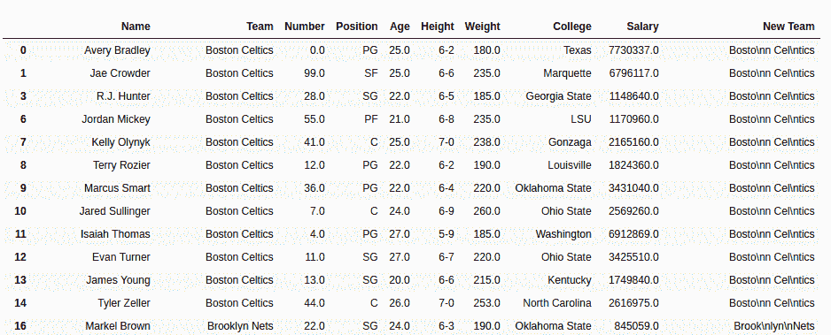

# Python | Pandas series . str . wrap()

> 原文:[https://www . geesforgeks . org/python-pandas-series-str-wrap/](https://www.geeksforgeeks.org/python-pandas-series-str-wrap/)

Python 是进行数据分析的优秀语言，主要是因为以数据为中心的 Python 包的奇妙生态系统。 ***【熊猫】*** 就是其中一个包，让导入和分析数据变得容易多了。

熊猫 **`str.wrap()`** 是处理长文本数据(段落或消息)的重要方法。这用于将长文本数据分布到新行中，或者在超过传递的宽度时处理制表符。既然这是一种弦法， ***。str*** 每次调用这个方法之前都要加上前缀。

> **语法:** Series.str.wrap(宽度，**kwargs)
> 
> **参数:**
> **宽度:**整数值，定义最大线宽
> 
> ****kwargs** 【可选参数】
> **expand _ tab:**布尔值，如果为 True
> **replace _ white spaces:**布尔值，如果为 True，每个空格字符被单个空格替换。
> **drop _ 空白:**布尔值，如果为真，则删除新行开头的空白(如果有)
> **break_long_words:** 布尔值，如果为真，则删除长于传递宽度的单词。
> **break _ on _ 连字符:**布尔值，如果为真，则在字符串长度小于宽度的连字符上断开字符串。
> 
> **返回类型:**带分割线/添加字符的序列(' \n ')

要下载代码中使用的数据集，点击这里的[。](https://media.geeksforgeeks.org/wp-content/uploads/nba.csv)

在下面的例子中，使用的数据框包含了一些 NBA 球员的数据。任何操作前的数据框图像附在下面。


**示例:**
在本例中，Team 列以 5 个字符的行宽换行。因此\n 将放在每 5 个字符之后。打印新团队列和旧团队列中的随机元素以查看工作情况。在应用任何操作之前，使用 **`.dropna()`** 方法移除空元素。

```py
# importing pandas module 
import pandas as pd

# reading csv file from url 
data = pd.read_csv("https://media.geeksforgeeks.org/wp-content/uploads/nba.csv")

# dropping null value columns to avoid errors
data.dropna(inplace = True)

# display
data["New Team"]= data["Team"].str.wrap(5)

# data frame display
data

# printing same index separately
print(data["Team"][120])
print("------------")
print(data["New Team"][120])
```

**输出:**
如输出图片所示，新列每 5 个字符后有“\n”。在打印新旧团队列的相同索引后，可以看到在 print 语句中没有添加新的行字符，python 会自动读取字符串中的“\n”并将其放入新的行中。

带有“新团队”列的数据框-


**输出:**

```py
Los Angeles Lakers
------------
Los A
ngele
s Lak
ers

```