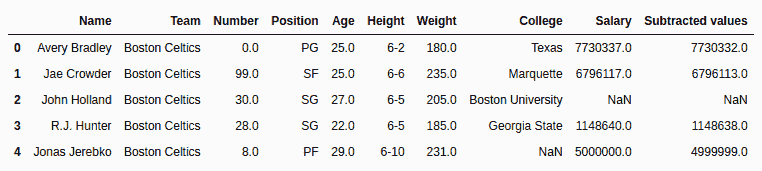
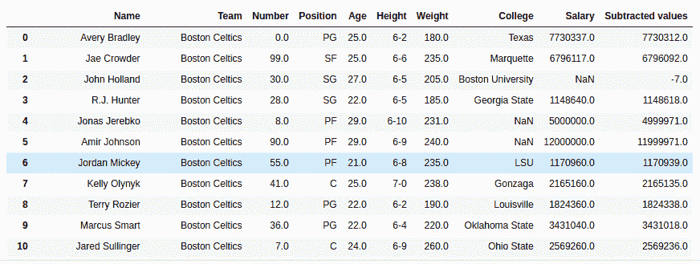

# 蟒蛇|熊猫系列(sub)

> 原文:[https://www.geeksforgeeks.org/python-pandas-series-sub/](https://www.geeksforgeeks.org/python-pandas-series-sub/)

Python 是进行数据分析的优秀语言，主要是因为以数据为中心的 Python 包的奇妙生态系统。 ***【熊猫】*** 就是其中一个包，让导入和分析数据变得容易多了。

Python **`Series.sub()`** 是用来从调用者序列中减去序列或者列表一样长度的对象。

> **语法:** Series.sub(其他，级别=无，fill _ value =无，轴=0)
> 
> **参数:**
> **其他:**要从调用者系列
> **中减去的其他系列或列表类型 fill_value:** 要在减去
> **级别之前用系列/列表中的 NaN 替换的值:**多索引情况下级别的整数值
> 
> **返回类型:**带减数值的调用者系列

要下载下例使用的数据集，点击这里的[。](https://media.geeksforgeeks.org/wp-content/uploads/nba.csv)
在下面的例子中，使用的数据框包含了一些 NBA 球员的数据。任何操作前的数据框图像附在下面。


**示例#1:** 减法列表

在本例中，前 5 行使用存储在新变量中。head()方法。之后，创建一个相同长度的列表，并使用。sub()方法

```py
# importing pandas module 
import pandas as pd

# reading csv file from url 
data = pd.read_csv("https://media.geeksforgeeks.org/wp-content/uploads/nba.csv")

# creating short data of 5 rows
short_data = data.head()

# creating list with 5 values
list =[5, 4, 3, 2, 1]

# subtracting list data
# creating new column
short_data["Subtracted values"]= short_data["Salary"].sub(list)

# display
short_data
```

**输出:**
如输出图所示，可以比较出减数值列是有薪资列–列表的减数值。


**示例#2:** 将序列添加到具有空值的序列中

在本例中，从“薪资”列中减去“年龄”列。由于薪资列也包含空值，默认情况下，无论减去什么，它都会返回 NaN。在本例中，传递 20，用 20 替换空值。

```py
# importing pandas module 
import pandas as pd

# reading csv file from url 
data = pd.read_csv("https://media.geeksforgeeks.org/wp-content/uploads/nba.csv")

# age series
age = data["Age"]

# na replacement
na = 20

# adding values
# storing to new column
data["Subtracted values"]= data["Salary"].sub(other = age, fill_value = na)

# display
data
```

**输出:**
如输出图像所示，在空值的情况下，减去值列已经从 20 减去了年龄列。
