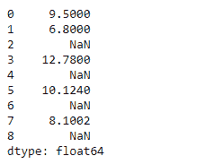
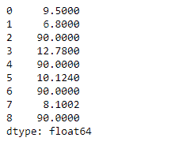

# 蟒蛇|熊猫系列.核减()

> 原文:[https://www . geesforgeks . org/python-pandas-series-减法/](https://www.geeksforgeeks.org/python-pandas-series-subtract/)

熊猫系列是带有轴标签的一维数组。标签不必是唯一的，但必须是可散列的类型。该对象支持基于整数和基于标签的索引，并提供了一系列方法来执行涉及索引的操作。

熊猫 `**Series.subtract()**`函数基本上执行数列和其他元素的减法(二元运算符 sub)。它相当于`series - other`，但支持用 fill_value 替换其中一个输入中缺失的数据。

> **语法:**系列。减去(其他，级别=无，填充值=无，轴=0)
> 
> **参数:**
> **其他:**系列或标量值
> **fill_value :** 填充现有缺失(NaN)值，以及成功系列对齐所需的任何新元素，在计算前使用该值。
> **级别:**跨级别广播，在传递的多索引级别上匹配索引值
> 
> **返回:**系列

**示例#1 :** 使用`Series.subtract()`函数从给定的序列对象元素中减去一个标量。

```py
# importing pandas as pd
import pandas as pd

# Creating the Series
sr = pd.Series([19.5, 16.8, None, 22.78, None, 20.124, None, 18.1002, None])

# Print the series
print(sr)
```

**输出:**


现在我们将使用`Series.subtract()`函数以标量元素的方式对该系列进行减法运算。

```py
# subtract all the elements of the 
# series by 10
sr.subtract(10)
```

**输出:**


正如我们在输出中看到的，`Series.subtract()`函数已经成功地将给定 Series 对象的所有元素减去了 10。请注意，没有对缺少的值执行减法。

**示例#2 :** 使用`Series.subtract()`函数从给定的序列对象元素中减去一个标量。也将缺少的值替换为 100。

```py
# importing pandas as pd
import pandas as pd

# Creating the Series
sr = pd.Series([19.5, 16.8, None, 22.78, None, 20.124, None, 18.1002, None])

# Print the series
print(sr)
```

**输出:**


现在我们将使用`Series.subtract()`函数以标量元素的方式对该系列进行减法运算。我们将用 100 替换系列对象中缺少的值。

```py
# subtract all the elements of the 
# series by 10 and also fill 100 at
# the place of missing values.
sr.subtract(10, fill_value = 100)
```

**输出:**



正如我们在输出中看到的，`Series.subtract()`函数已经成功地将给定 Series 对象的所有元素减去了 10。注意我们是如何在缺失值的地方替换 100 的。