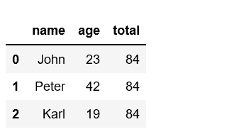

# 蟒蛇|熊猫系列. sum()

> 原文:[https://www.geeksforgeeks.org/python-pandas-series-sum/](https://www.geeksforgeeks.org/python-pandas-series-sum/)

Python 是进行数据分析的优秀语言，主要是因为以数据为中心的 python 包的奇妙生态系统。 ***【熊猫】*** 就是其中一个包，让导入和分析数据变得容易多了。

熊猫 **`Series.sum()`** 方法用于获取所请求轴的值的总和。

> **语法:**数列.和(轴=无，skipna =无，级别=无，numeric _ only =无，min_count=0)
> 
> **参数:**
> **轴:** {index (0)}
> **skipna【布尔值，默认真】:**排除 NA/null 值。如果整行/整列是 NA，结果将是 NA
> **级别[int 或级别名称，默认无] :** 如果轴是多索引(分层)，沿特定级别计数，折叠成标量。
> **numeric_only[boolean，默认无] :** 仅包括 float、int、boolean 数据。如果没有，将尝试使用所有内容，然后只使用数字数据
> 
> **返回:**返回所请求坐标轴的值的总和

**代码#1:** 默认情况下，空或全 NA 序列的和为 0。

```
# importing pandas module 
import pandas as pd 

# min_count = 0 is the default
pd.Series([]).sum()

# When passed  min_count = 1,
# sum of an empty series will be NaN
pd.Series([]).sum(min_count = 1)
```

**输出:**

```
0.0
nan
```

**代码#2:**

```
# importing pandas module 
import pandas as pd 

# making data frame csv at url  
data = pd.read_csv("https://media.geeksforgeeks.org/wp-content/uploads/nba.csv") 

# sum of all salary
val = data['Salary'].sum()

val
```

**输出:**

```
2159837111.0
```

**代码#3:**

```
# importing pandas module 
import pandas as pd 

# making a dict of list
data = {'name': ['John', 'Peter', 'Karl'],
        'age' : [23, 42, 19]}

val = pd.DataFrame(data)

# sum of all salary
val['total'] = val['age'].sum()

val
```

**输出:**
