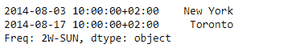
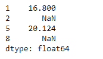

# 蟒蛇|熊猫系列. take()

> 原文:[https://www.geeksforgeeks.org/python-pandas-series-take/](https://www.geeksforgeeks.org/python-pandas-series-take/)

熊猫系列是带有轴标签的一维数组。标签不必是唯一的，但必须是可散列的类型。该对象支持基于整数和基于标签的索引，并提供了一系列方法来执行涉及索引的操作。

熊猫 `**Series.take()**`函数返回给定位置索引中沿轴的元素。这里我们不是根据对象的索引属性中的实际值进行索引。我们根据元素在对象中的实际位置进行索引。

> **语法:**系列。取(索引，轴=0，转换=无，is _ copy =真，**kwargs)
> 
> **参数:**
> **指数:**一组指示采取哪些立场的整数。
> **轴:**选择元素的轴。
> **- >** 0 表示我们在选行。
> **- >** 1 表示我们在选列。
> **转换:**是否将负指数转换为正指数
> **为 _copy :** 是否返回原对象的副本。
> *** *夸脱:**与 numpy.take()兼容。对输出没有影响。
> 
> **返回:**采取:与呼叫者相同的类型

**示例#1:** 使用`Series.take()`功能，根据元素在对象中的实际位置，从给定的序列对象中提取一些元素。

```
# importing pandas as pd
import pandas as pd

# Creating the Series
sr = pd.Series(['New York', 'Chicago', 'Toronto', 'Lisbon', 'Rio', 'Moscow'])

# Create the Datetime Index
didx = pd.DatetimeIndex(start ='2014-08-01 10:00', freq ='W', 
                     periods = 6, tz = 'Europe/Berlin') 

# set the index
sr.index = didx

# Print the series
print(sr)
```

**输出:**


现在我们将使用`Series.take()`函数提取对应于传递位置的值。

```
# return elements corresponding to
# the passed index position
sr.take(indices = [0, 2])
```

**输出:**



正如我们在输出中看到的那样，`Series.take()`函数已经成功地返回了对应于给定序列对象的传递索引位置的元素。

**示例 2:** 使用`Series.take()`功能，根据元素在对象中的实际位置，从给定的序列对象中提取一些元素。

```
# importing pandas as pd
import pandas as pd

# Creating the Series
sr = pd.Series([19.5, 16.8, None, 22.78, None, 20.124, None, 18.1002, None])

# Print the series
print(sr)
```

**输出:**


现在我们将使用`Series.take()`函数提取对应于传递位置的值。

```
# return elements corresponding to
# the passed index position
sr.take(indices = [1, 2, 5, 8])
```

**输出:**



正如我们在输出中看到的那样，`Series.take()`函数已经成功地返回了对应于给定序列对象的传递索引位置的元素。