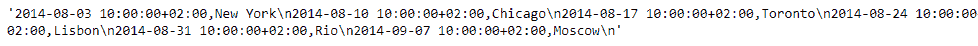
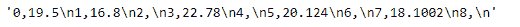

# Python | Pandas series . to _ CSV()

> 原文:[https://www.geeksforgeeks.org/python-pandas-series-to_csv/](https://www.geeksforgeeks.org/python-pandas-series-to_csv/)

熊猫系列是带有轴标签的一维数组。标签不必是唯一的，但必须是可散列的类型。该对象支持基于整数和基于标签的索引，并提供了一系列方法来执行涉及索引的操作。

Pandas `**Series.to_csv()**`函数将给定的序列对象写入逗号分隔值(csv)文件/格式。

> **语法:** Series.to_csv(*args，**kwargs)
> 
> **参数:**
> **路径 _or_buf :** 文件路径或对象，如果未提供，结果将作为字符串返回。
> **sep :** 长度为 1 的字符串。输出文件的字段分隔符。
> **na_rep :** 缺失数据表示。
> **float_format :** 浮点数的格式字符串。
> **列:**要写入的列
> **标题:**如果给定了字符串列表，则假定它是列名的别名。
> **索引:**写行名(索引)。
> **索引标签:**索引列的列标签(如果需要)。如果没有给定，并且头和索引为真，则使用索引名。
> **模式:** Python 写模式，默认‘w’。
> **编码:**表示输出文件中使用的编码的字符串。
> **压缩:**以下可能值中的压缩模式:{ ' infer '，' gzip '，' bz2 '，' zip '，' xz '，None}。
> **引用:**默认为 csv。QUOTE _ MINIMAL。
> **quotechar :** 长度为 1 的字符串。用于引用字段的字符。
> 
> **返回:**无或字符串

**示例#1:** 使用`Series.to_csv()`功能将给定的序列对象转换为 csv 格式。

```
# importing pandas as pd
import pandas as pd

# Creating the Series
sr = pd.Series(['New York', 'Chicago', 'Toronto', 'Lisbon', 'Rio', 'Moscow'])

# Create the Datetime Index
didx = pd.DatetimeIndex(start ='2014-08-01 10:00', freq ='W', 
                     periods = 6, tz = 'Europe / Berlin') 

# set the index
sr.index = didx

# Print the series
print(sr)
```

**输出:**


现在我们将使用`Series.to_csv()`函数将给定的 Series 对象转换为逗号分隔的格式。

```
# convert to comma-separated
sr.to_csv()
```

**输出:**


正如我们在输出中看到的，`Series.to_csv()`函数已经将给定的 Series 对象转换为逗号分隔的格式。

**示例 2:** 使用`Series.to_csv()`功能将给定的序列对象转换为 csv 格式。

```
# importing pandas as pd
import pandas as pd

# Creating the Series
sr = pd.Series([19.5, 16.8, None, 22.78, None, 20.124, None, 18.1002, None])

# Print the series
print(sr)
```

**输出:**


现在我们将使用`Series.to_csv()`函数将给定的 Series 对象转换为逗号分隔的格式。

```
# convert to comma-separated
sr.to_csv()
```

**输出:**



正如我们在输出中看到的那样，`Series.to_csv()`函数已经将给定的 Series 对象转换为逗号分隔的格式。