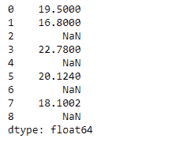
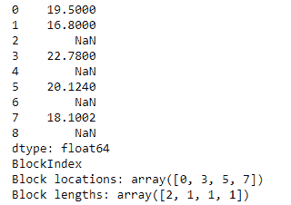

# 蟒蛇|熊猫系列. to _ 密集()

> 原文:[https://www . geesforgeks . org/python-pandas-series-to _ density/](https://www.geeksforgeeks.org/python-pandas-series-to_dense/)

熊猫系列是带有轴标签的一维数组。标签不必是唯一的，但必须是可散列的类型。该对象支持基于整数和基于标签的索引，并提供了一系列方法来执行涉及索引的操作。

熊猫 `**Series.to_dense()**`函数返回 NDFrame 的密集表示(与稀疏表示相反)。这基本上意味着将分配内存来存储数据帧中丢失的值。

> **语法:**series . to _ density()
> 
> **参数:**无
> 
> **返回:**密集序列

**示例#1:** 使用`Series.to_dense()`函数将给定的序列对象转换为密集序列对象。

```py
# importing pandas as pd
import pandas as pd

# Creating the Series
sr = pd.Series(['New York', 'Chicago', 'Toronto', 'Lisbon', 'Rio', 'Moscow'])

# Create the Datetime Index
didx = pd.DatetimeIndex(start ='2014-08-01 10:00', freq ='W', 
                     periods = 6, tz = 'Europe/Berlin') 

# set the index
sr.index = didx

# Print the series
print(sr)
```

**输出:**


现在我们将使用`Series.to_dense()`函数来实现给定 series 对象到密集 Series 对象的转换。

```py
# convert to dense object
sr.to_dense()
```

**输出:**

<

正如我们在输出中看到的，`Series.to_dense()`函数返回了给定序列对象的密集表示。如果我们注意到我们的序列对象没有任何丢失的值，那么两个输出看起来是一样的。让我们看看另一个包含一些缺失值的例子。

**示例 2:** 使用`Series.to_dense()`功能将给定的系列对象转换为密集系列对象。

```py
# importing pandas as pd
import pandas as pd

# Creating the Series
sr = pd.Series([19.5, 16.8, None, 22.78, None, 20.124, None, 18.1002, None])

# Print the series
print(sr)
```

**输出:**



但是，在我们继续之前，让我们将给定的系列对象转换为稀疏存储对象，看看稀疏版本和密集版本之间的区别。

现在我们将使用`Series.to_sparse()`函数来实现给定的 Series 对象到 SparseSeries 对象的转换。

```py
# convert to Sparse object
sr.to_sparse()
```

**输出:**



正如我们在输出中看到的那样，`Series.to_sparse()`函数已经成功地将给定的序列对象转换为稀疏对象。如果我们看下面两行，它已经返回了关于内存块位置和包含在这些块中的值的数量的信息。

现在我们将使用`Series.to_dense()`函数来实现给定 series 对象到密集 Series 对象的转换。

```py
# convert to dense object
sr.to_dense()
```

**输出:**


正如我们在输出中看到的，`Series.to_dense()`函数返回了给定序列对象的密集表示。它分配了内存来存储序列中丢失的值。当大量数据丢失时，密集表示的内存效率不高。