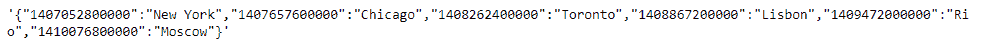
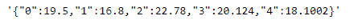

# Python | Pandas series . to _ JSON()

> 原文:[https://www.geeksforgeeks.org/python-pandas-series-to_json/](https://www.geeksforgeeks.org/python-pandas-series-to_json/)

熊猫系列是带有轴标签的一维数组。标签不必是唯一的，但必须是可散列的类型。该对象支持基于整数和基于标签的索引，并提供了一系列方法来执行涉及索引的操作。

熊猫 `**Series.to_json()**`函数用于将对象转换为 JSON 字符串。还要注意，NaN 和 None 将被转换为 null，datetime 对象将被转换为 UNIX 时间戳。

> **语法:**series . to _ JSON(path _ or _ buf = None，orient=None，date_format=None，double_precision=10，force_ascii=True，date_unit='ms '，default_handler=None，lines = False，compression = ' infer '，index=True)
> 
> **参数:**
> **路径 _or_buf :** 文件路径或对象。如果未指定，结果将作为字符串返回。
> **方向:**预期 JSON 字符串格式的指示。
> **date_format :** None、' epoch '、' iso ' }
> **double _ precision:**对浮点值进行编码时要使用的小数位数。
> **force_ascii :** 强制编码字符串为 ascii。
> **date_unit :** string，默认' ms '(毫秒)
> **default _ handler:**callable，默认 None
> **line:**bool，默认 False
> **compression:**{ ' expert '，' gzip '，' bz2 '，' zip '，' xz '，None}
> 
> **返回:** Json 字符串

**示例#1:** 使用`Series.to_json()`函数将给定的序列对象转换为 JSON 字符串。

```
# importing pandas as pd
import pandas as pd

# Creating the Series
sr = pd.Series(['New York', 'Chicago', 'Toronto', 'Lisbon', 'Rio', 'Moscow'])

# Create the Datetime Index
didx = pd.DatetimeIndex(start ='2014-08-01 10:00', freq ='W', 
                     periods = 6, tz = 'Europe/Berlin') 

# set the index
sr.index = didx

# Print the series
print(sr)
```

**输出:**


现在我们使用`Series.to_json()`函数将给定的序列对象转换为 JSON 字符串。

```
# convert to JSON string
sr.to_json()
```

**输出:**



正如我们在输出中看到的，`Series.to_json()`函数已经成功地将给定的序列对象转换为 JSON 字符串。

**示例 2:** 使用`Series.to_json()`函数将给定的序列对象转换为 JSON 字符串。

```
# importing pandas as pd
import pandas as pd

# Creating the Series
sr = pd.Series([19.5, 16.8, 22.78, 20.124, 18.1002])

# Print the series
print(sr)
```

**输出:**


现在我们使用`Series.to_json()`函数将给定的序列对象转换为 JSON 字符串。

```
# convert to JSON string
sr.to_json()
```

**输出:**



正如我们在输出中看到的，`Series.to_json()`函数已经成功地将给定的序列对象转换为 JSON 字符串。