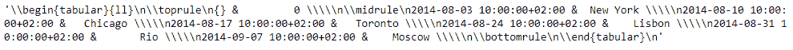
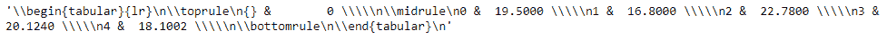

# 蟒蛇|熊猫系列. to_latex()

> 原文:[https://www . geesforgeks . org/python-pandas-series-to _ latex/](https://www.geeksforgeeks.org/python-pandas-series-to_latex/)

熊猫系列是带有轴标签的一维数组。标签不必是唯一的，但必须是可散列的类型。该对象支持基于整数和基于标签的索引，并提供了一系列方法来执行涉及索引的操作。
Pandas**series . to _ latex()**函数将对象渲染到 LaTeX 表格环境表中。

> **语法:** Series.to_latex(buf=None，col_space=None，header=True，index=True，na_rep='NaN '，formatters=None，float_format=None，sparsify=None，index _ names = True，bold_rows=False，column_format=None，longtable=None，escape=None，编码=None，decimal= ' '，多列=无，多列 _ 格式=无，多行=无)
> **参数:**
> **buf :** 要写入的缓冲区。如果为无，输出将作为字符串返回。
> **列:**要写的列的子集。默认情况下写入所有列。
> **col_space :** 每列的最小宽度。
> **表头:**写出列名。如果给出了字符串列表，则假定它是列名的别名。
> **索引:**写行名(索引)
> **na_rep :** 缺失数据表示。
> **格式化程序:**格式化程序通过位置或名称应用于列的元素。
> **float_format :** 浮点数的格式字符串。
> **稀疏化:**对具有分层索引的数据帧设置为假，以打印每行的每个多索引键。
> **返回:**如果 buf 为 None，则以字符串形式返回结果 LateX 格式，否则返回 None。

**示例#1:** 使用 Series.to_latex()函数将给定的系列对象渲染到 latex 表格环境表中。

## 蟒蛇 3

```
# importing pandas as pd
import pandas as pd

# Creating the Series
sr = pd.Series(['New York', 'Chicago', 'Toronto', 'Lisbon', 'Rio', 'Moscow'])

# Create the Datetime Index
didx = pd.DatetimeIndex(start ='2014-08-01 10:00', freq ='W',
                     periods = 6, tz = 'Europe/Berlin')

# set the index
sr.index = didx

# Print the series
print(sr)
```

**输出:**


现在我们将使用 Series.to_latex()函数将给定的 Series 对象渲染到 latex 表格环境表中。

## 蟒蛇 3

```
# render to LaTeX tabular environment table.
sr.to_latex()
```

**输出:**



正如我们在输出中看到的，Series.to_latex()函数已经成功地将给定的 Series 对象呈现到 latex 表格环境表中。

**示例#2:** 使用 Series.to_latex()函数将给定的系列对象渲染到 latex 表格环境表中。

## 蟒蛇 3

```
# importing pandas as pd
import pandas as pd

# Creating the Series
sr = pd.Series([19.5, 16.8, 22.78, 20.124, 18.1002])

# Print the series
print(sr)
```

**输出:**


现在我们将使用 Series.to_latex()函数将给定的 Series 对象渲染到 latex 表格环境表中。

## 蟒蛇 3

```
# render to LaTeX tabular environment table.
sr.to_latex()
```

**输出:**



正如我们在输出中看到的，Series.to_latex()函数已经成功地将给定的 Series 对象呈现到 latex 表格环境表中。