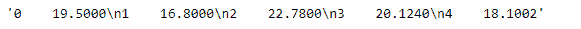

# Python | Pandas series . to _ string()

> 原文:[https://www . geesforgeks . org/python-pandas-series-to _ string/](https://www.geeksforgeeks.org/python-pandas-series-to_string/)

熊猫系列是带有轴标签的一维数组。标签不必是唯一的，但必须是可散列的类型。该对象支持基于整数和基于标签的索引，并提供了一系列方法来执行涉及索引的操作。

熊猫 `**Series.to_string()**`函数呈现系列的字符串表示。

> **语法:**series . to _ string(buf =无，na_rep='NaN '，float _ format =无，header =真，index =真，length =假，dtype =假，name =假，max _ rows =无)
> 
> **参数:**
> **buf :** 缓冲区写入
> **na_rep :** 要使用的 NAN 的字符串表示，默认为‘NAN’
> **float _ format:**格式化程序函数应用于列的元素如果它们是 float 则默认为无
> **标题:**添加系列标题(索引名)
> **索引:**添加索引(行)标签， 默认真
> **长度:**添加系列长度
> **数据类型:**添加系列数据类型
> **名称:**如果不是无则添加系列名称
> **最大行数:**截断前要显示的最大行数。
> 
> **返回:**格式化字符串。

**示例#1:** 使用`Series.to_string()`函数渲染给定序列对象的字符串表示。

```
# importing pandas as pd
import pandas as pd

# Creating the Series
sr = pd.Series(['New York', 'Chicago', 'Toronto', 'Lisbon', 'Rio', 'Moscow'])

# Create the Datetime Index
didx = pd.DatetimeIndex(start ='2014-08-01 10:00', freq ='W', 
                     periods = 6, tz = 'Europe/Berlin') 

# set the index
sr.index = didx

# Print the series
print(sr)
```

**输出:**


现在我们将使用`Series.to_string()`函数将字符串表示呈现给这个序列对象。

```
# render to string form
sr.to_string()
```

**输出:**


正如我们在输出中看到的那样，`Series.to_string()`函数已经成功地为给定的对象呈现了一个字符串表示。

**示例 2:** 使用`Series.to_string()`函数渲染给定序列对象的字符串表示。

```
# importing pandas as pd
import pandas as pd

# Creating the Series
sr = pd.Series([19.5, 16.8, 22.78, 20.124, 18.1002])

# Print the series
print(sr)
```

**输出:**


现在我们将使用`Series.to_string()`函数将字符串表示呈现给这个序列对象。

```
# render to string form
sr.to_string()
```

**输出:**



正如我们在输出中看到的那样，`Series.to_string()`函数已经成功地为给定的对象呈现了一个字符串表示。