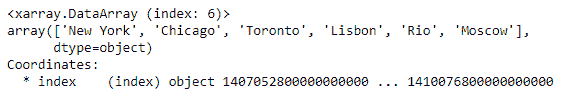
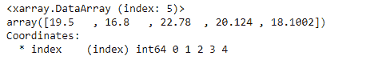

# Python | Pandas series . to _ xarray()

> 原文:[https://www . geesforgeks . org/python-pandas-series-to _ xarray/](https://www.geeksforgeeks.org/python-pandas-series-to_xarray/)

熊猫系列是带有轴标签的一维数组。标签不必是唯一的，但必须是可散列的类型。该对象支持基于整数和基于标签的索引，并提供了一系列方法来执行涉及索引的操作。

熊猫 `**Series.to_xarray()**`函数从熊猫对象返回一个 xarray 对象。

**注意:**你需要在电脑中安装`xarray`库。

> **语法:** Series.to_xarray()
> 
> **参数:**无
> 
> **返回:** xarray。DataArray 或 xarray。资料组

**示例#1:** 使用`Series.to_xarray()`函数将给定的 Series 对象转换为 xarray 对象。

```py
# importing pandas as pd
import pandas as pd

# Creating the Series
sr = pd.Series(['New York', 'Chicago', 'Toronto', 'Lisbon', 'Rio', 'Moscow'])

# Create the Datetime Index
didx = pd.DatetimeIndex(start ='2014-08-01 10:00', freq ='W', 
                     periods = 6, tz = 'Europe/Berlin') 

# set the index
sr.index = didx

# Print the series
print(sr)
```

**输出:**


现在我们使用`Series.to_xarray()`函数将给定的序列对象转换为 xarray 对象。

```py
# convert to xarray
sr.to_xarray()
```

**输出:**



正如我们在输出中看到的，`Series.to_xarray()`函数已经成功地将给定的序列对象转换为 xarray 对象。

**示例#2:** 使用`Series.to_xarray()`函数将给定的 Series 对象转换为 xarray 对象。

```py
# importing pandas as pd
import pandas as pd

# Creating the Series
sr = pd.Series([19.5, 16.8, 22.78, 20.124, 18.1002])

# Print the series
print(sr)
```

**输出:**


现在我们使用`Series.to_xarray()`函数将给定的序列对象转换为 xarray 对象。

```py
# convert to xarray
sr.to_xarray()
```

**输出:**



正如我们在输出中看到的，`Series.to_xarray()`函数已经成功地将给定的序列对象转换为 xarray 对象。