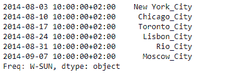
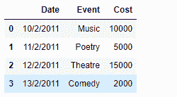
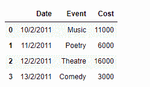

# Python | Pandas series . transform()

> 原文:[https://www . geesforgeks . org/python-pandas-series-transform/](https://www.geeksforgeeks.org/python-pandas-series-transform/)

熊猫系列是带有轴标签的一维数组。标签不必是唯一的，但必须是可散列的类型。该对象支持基于整数和基于标签的索引，并提供了一系列方法来执行涉及索引的操作。

熊猫 `**Series.transform()**`函数调用函数(传递的函数)自行生成一个具有转换值的序列，该序列具有与自身相同的轴长。

> **语法:** Series.transform(func，axis=0，*args，**kwargs)
> 
> **参数:**
> **功能:**如果一个函数，必须要么在传递给 Series 时工作，要么在传递给 Series 时工作。应用
> **轴:**与 DataFrame 兼容所需的参数。
> ***参数:**要传递给 func 的位置参数。
> ****kwargs :** 要传递给 func 的关键字参数。
> 
> **返回:**返回必须与自身长度相同的序列。

**示例#1:** 使用`Series.transform()`函数变换给定系列对象的元素。在每个城市名称的末尾添加“_City”。

```
# importing pandas as pd
import pandas as pd

# Creating the Series
sr = pd.Series(['New York', 'Chicago', 'Toronto', 'Lisbon', 'Rio', 'Moscow'])

# Create the Datetime Index
didx = pd.DatetimeIndex(start ='2014-08-01 10:00', freq ='W', 
                     periods = 6, tz = 'Europe/Berlin') 

# set the index
sr.index = didx

# Print the series
print(sr)
```

**输出:**


现在我们将使用`Series.transform()`函数在每个城市名称的末尾追加“_City”。

```
# append '_City'
sr.transform(lambda x : x + '_City')
```

**输出:**


正如我们在输出中看到的，`Series.transform()`函数已经成功地在哪个城市名称的末尾追加了想要的关键词。

**示例 2:** 使用`Dataframe.transform()`函数转换给定数据帧的数据。每连门票费用增加 1000。

```
# importing pandas as pd
import pandas as pd

# Creating the Dataframe
df = pd.DataFrame({'Date':['10/2/2011', '11/2/2011', '12/2/2011', '13/2/2011'],
                    'Event':['Music', 'Poetry', 'Theatre', 'Comedy'],
                    'Cost':[10000, 5000, 15000, 2000]})

# Print the dataframe
print(df)
```

**输出:**



现在我们将使用`Dataframe.transform()`功能增加 1000 的门票费用

```
# transform the 'Cost' column
df['Cost'] = df['Cost'].transform(lambda x : x + 1000)

# Print the dataframe after modification
print(df)
```

**输出:**



从输出中我们可以看到，`Dataframe.transform()`功能成功的将每个赛事的门票成本提高了 1000。