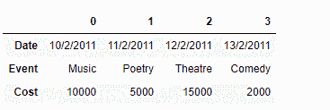

# Python | Pandas Series .转置()

> 原文:[https://www . geesforgeks . org/python-pandas-series-transpose/](https://www.geeksforgeeks.org/python-pandas-series-transpose/)

熊猫系列是带有轴标签的一维数组。标签不必是唯一的，但必须是可散列的类型。该对象支持基于整数和基于标签的索引，并提供了一系列方法来执行涉及索引的操作。

熊猫 `**Series.transpose()**`函数返回转置，顾名思义就是自我。

> **语法:** Series .转置(*args，**kwargs)
> 
> **参数:**无
> 
> **返回:**自我

**示例#1:** 使用`Series.transpose()`函数找到给定 Series 对象的转置。

```py
# importing pandas as pd
import pandas as pd

# Creating the Series
sr = pd.Series(['New York', 'Chicago', 'Toronto', 'Lisbon', 'Rio', 'Moscow'])

# Create the Datetime Index
didx = pd.DatetimeIndex(start ='2014-08-01 10:00', freq ='W', 
                     periods = 6, tz = 'Europe/Berlin') 

# set the index
sr.index = didx

# Print the series
print(sr)
```

**输出:**


现在我们用`Series.transpose()`函数求给定级数对象的转置。

```py
# find the transpose
sr.transpose()
```

**输出:**


正如我们在输出中看到的，`Series.transpose()`函数已经返回了与给定序列对象的转置相同的对象，根据定义，这是 self。

**示例 2:** 使用`Dataframe.transpose()`函数查找给定数据帧的转置。

```py
# importing pandas as pd
import pandas as pd

# Creating the Dataframe
df = pd.DataFrame({'Date':['10/2/2011', '11/2/2011', '12/2/2011', '13/2/2011'],
                    'Event':['Music', 'Poetry', 'Theatre', 'Comedy'],
                    'Cost':[10000, 5000, 15000, 2000]})

# Print the dataframe
print(df)
```

**输出:**


现在我们将使用`Dataframe.transpose()`函数找到给定数据帧的转置。

```py
# find the transpose
df.transpose()
```

**输出:**



正如我们在输出中看到的那样，`Dataframe.transpose()`函数已经成功地返回了给定 Dataframe 对象的转置。